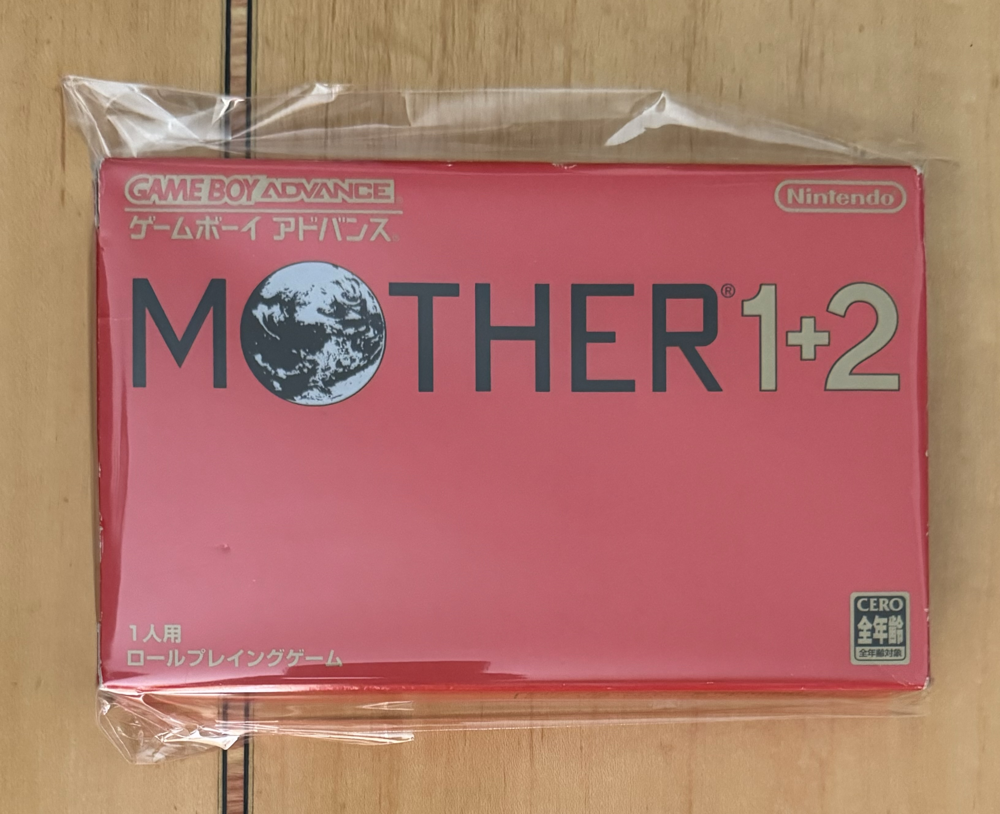
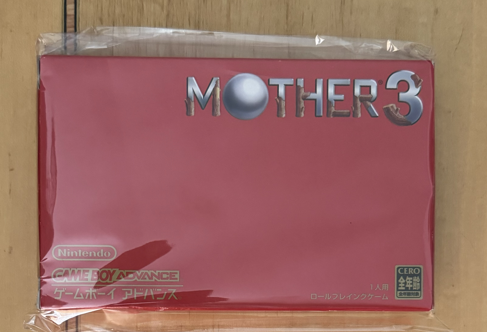
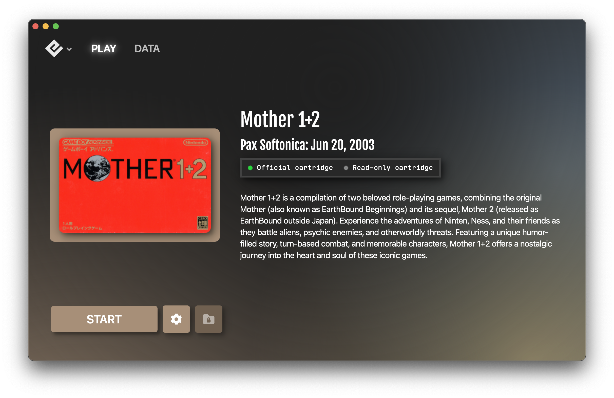
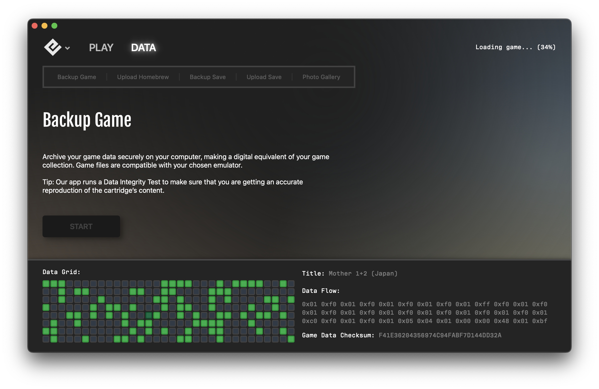
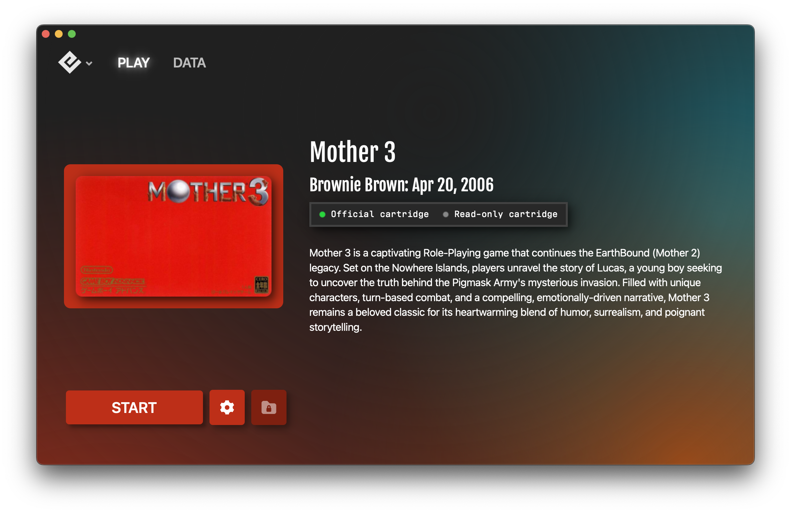
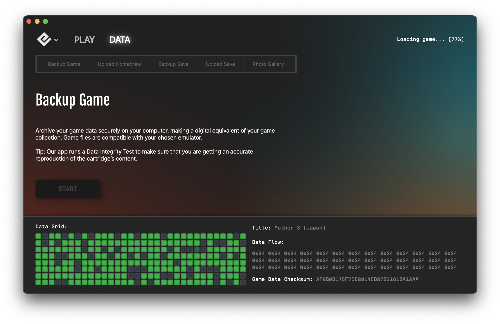
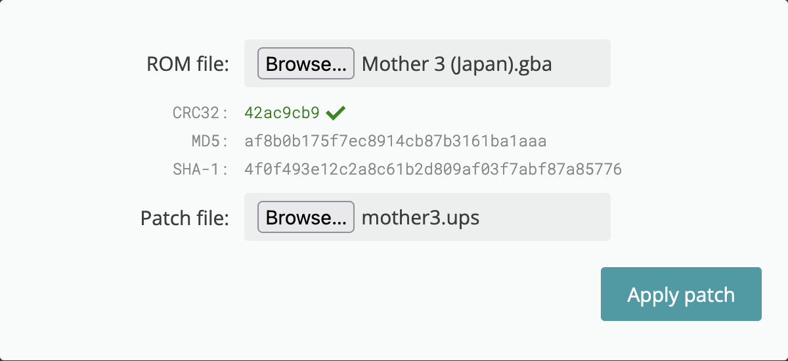
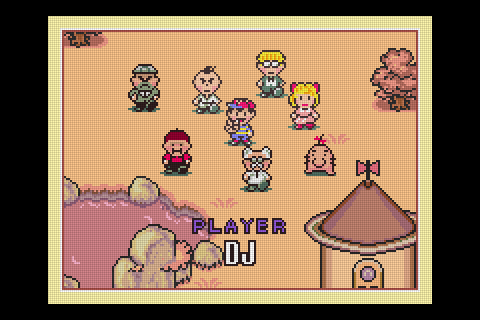

# Mother 1, 2, and 3 for GBA, English Patched

Circa January 2024 I read a random tweet about a game store clerk that remembered Mother 3 and how moving it was (I tried, but cannot find the tweet).

Curious, I research it.
There's nothing that you cannot find on your own, the net is Mother 1-3 are Japanese JRPG games for the NES, SNES, then GBA.
There are English translations for all 3.
Mother 1 and 2 can be played on the Switch using the NES (Mother 1/EarthBound Beginnings) and the SNES (Mother 2/EarthBound) emulators from Nintendo Switch Online (or find the ROMs and play on other emulators).

After talking to a colleague (a _real_ gamer that played EarthBound and EarthBound Beginnings) and reading the opinions of a few randos on Reddit, I decided to start with Mother 2, then 3, then perhaps 1.

> I started playing RPGs in 1983 with Wizardry, and I've never completed a single one until Mother 2.

I ended up playing the English translated Japanese versions for the GBA on my Analogue Pocket since the GBA core has save states and the current SNES core does not.

## Patches

### Mother 1

[MOTHER 1+2 English v1.01.zip](http://mother12.earthboundcentral.com/MOTHER%201+2%20English%20v1.01.zip)

> From `mother12.txt`: _MOTHER 1 has been completely retranslated from scratch and features many
improvements to make the game more palatable for fans. MOTHER 2 has a basic
"menu patch"-style translation that translates menus, item names, and more._

Use this only for Mother 1.

### Mother 2

[https://github.com/jeffman/Mother2GbaTranslation](https://github.com/jeffman/Mother2GbaTranslation)

I had no issues playing to the end with this patch.  See my notes below.

### Mother 3

[MOTHER3_EarthBound2_English_v1.3.zip](https://mother3.fobby.net/MOTHER3_EarthBound2_English_v1.3.zip)

I put in about an hour of play time.  No issues.


## How to Patch (MacOS notes)

### Obtain Carts

Got from eBay:

<p align="center">
  
  
</p>

### Backup Carts

I used [GB Operator](https://www.epilogue.co/product/gb-operator) to backup.  For each verify the md5sum is a match with this doc.

<p align="center">
  
  
</p>

Checksum should be: `f41e36204356974c94fabf7d144dd32a`

Filename should be: `Mother 1+2 (Japan).gba`

<p align="center">
  
  
</p>

Checksum should be: `af8b0b175f7ec8914cb87b3161ba1aaa`

Filename should be: `Mother 3 (Japan).gba`


### Patch Mother 1

Unzip `MOTHER 1+2 English v1.01.zip` then goto https://www.marcrobledo.com/RomPatcher.js/, fill out the form and then check your downloads for `Mother 1+2 (Japan) (patched).gba` and rename to `Mother 1 (En).gba`.  Verify the md5sum is `68806f7e40e1f082b21a8b920e8982db`.

<p align="center">
  
</p>


### Patch Mother 2

Install Docker.  There are a few options for this, but the easiest for Mac and Windows is [Docker Desktop](https://docs.docker.com/get-docker/).
(`brew install colima` worked for me as well.)

> Apple Silicon users may need to install Rosetta2.
It should work without Rosetta2, but may be a bit slow.
You'll have to also enable Rosetta2 in Docker (Docker Desktop and colima have different ways of doing this).
In the end it'll probably only save you about two minutes.

```
$ git clone https://github.com/jeffman/Mother2GbaTranslation
$ cd Mother2GbaTranslation
$ cp DIR_OF_BACKUP_ROMS/Mother\ 1+2\ \(Japan\).gba bin/m12fresh.gba
$ docker run --rm -it -v ${PWD}:/home/m2gba/src lorenzooone/m2gba_translation:builder
$ cp out/m12.gba DIR_OF_YOUR_ROMS/Mother\ 2\ \(En\).gba
$ docker rmi lorenzooone/m2gba_translation:builder
```

The md5sum will be different for each build, even if you build twice; it'll have 4-8 bytes different.  I did not investigate, but I suspect some type of timestamp.


### Patch Mother 3

Unzip `MOTHER3_EarthBound2_English_v1.3.zip` then goto https://www.marcrobledo.com/RomPatcher.js/, fill out the form and then check your downloads for `Mother 3 (Japan) (patched).gba` and rename to `Mother 3 (En).gba`.  Verify the md5sum is `78852690de6ef51af56883c3823ea0e1`.

<p align="center">
  
</p>


## Gameplay Notes on Mother 1, 2, and 3

### Mother 1

TBD, if ever.


### Mother 2

Cheating (I could not find any documentation on this; discovered this on my own):

The debug menu can be had if you use the ATM card when there's no ATM.

My poor notes on the menu structure:

```
1. party setup
2. goods setup
    1. add goods, see item_index.md in this repo for the numbers
3. status condition
    1. healthy
    2. unconscious
    3. diamondized
    4. numb
    5. nauseous
    6. poisoned
    7. sunstroke
    8. cold
    9. mushroomized
    10. possessed
    11. homesick
    12. reducecd hp
    13. reduced pp
    14. exit?
4. move
    1. onett (but was town 3)
5. money setup
    1. fill bank 9999999
6. give exp (move all to level 99, takes a while, mini-grind)
7. unused scripts?
8. saturn item test
9. hint shop hints
10. sound
11. descriptions
12. teleport
13. put hint shops on map
14. build info
```

I was faithful to the game until close to the very end where you have to grind and grind to get from around level 80 to 99 which IMHO is required to finish the game.
So save yourself some time and use the _give exp_ debug menu item.

There's a minor bug in the translation: in the fourth town the English text "Cafe" is really the "Bar" (graphic).
The English translation text is probably ripped from the SNES English version where the graphic was changed from "Bar" to "Cafe".
I lost a bit of time looking for the "Cafe".

The music is incredible ([here, have a listen for yourself](https://www.youtube.com/watch?v=6hBF1WZeT_M)).

The story, writing, humor, characters, _intensity_, _presentation_, etc... are all great, amazing actually.
I would strongly recommend playing this game on SNES or GBA.

Google for walkthroughs, there are many if you need help.

<p align="center">
  
</p>

### Mother 3

TBD (currently distracted with Gen 2 Pokémon research).
