<style>
pre[class*=language-]
{font-size: 0.8em;} 
</style>
# Pokémon Emerald Postmortem (with cheat code)

*<p align="center"><br>[2024 is the first time I have played Game Boy or Pokémon games.<br>
FF and save file editing to reduce the toil is a must for me.<br>
I'm not a 10-year-old kid with unlimited time on my hands, and who am I going to trade with?<br>
-- datajerk<br><br>](https://www.reddit.com/r/AnaloguePocket/comments/1e9pc0g/comment/legxrj2/)</p>*


> If you're just looking for the cheat code, then [here it is](./emeralditor.py);
it should be pretty easy to figure out.
Below was my thought process and evolution of the script with examples.
This isn't a comprehensive savefile editor, just what I needed for my playthrough.
Enjoy!


## Objective

This is my third Pokémon playthrough; my first was Polished Crystal (postmortem on hold) followed by [Red](../pokered/README.md).
My methods and rational are not dissimilar from my [Red run](../pokered/README.md) and I'd recommend reading that [postmortem](../pokered/README.md) first.

My objective was to experience [Pokémon Emerald](https://bulbapedia.bulbagarden.net/wiki/Pok%C3%A9mon_Emerald_Version) as quickly as possible
as game research vs. game play
without hours of repeated toil.


## Tools and Resources

* [Anbernic RG35XXSP](https://anbernic.com/products/rg35xxsp) with [muOS 2405.2 BAKED BEANS](https://muos.dev/release/current/baked).
This setup checked all the boxes:
  * Real-Time-Clock (RTC)
  * Easy backup/rotation of savefiles
  * Save states
  * Fast-forward (FF)
  * Slow-motion (slowmo)--slowmo is something I did not know I'd need until I needed it.
  * Can run my cheat script on-device!
  * [gpSP](https://docs.libretro.com/library/gpsp/) core with [Retroarch](https://www.retroarch.com/) (the GBA overlay looks fantastic)
* The [mGBA](https://mgba.io/) emulator for MacOS was used when I needed to test some ideas and my cheat code.
* The [Pokemon Emerald (Prima 2005) Guide](https://archive.org/details/Prima2005PokemonEmerald) was my initial guide, but decided in the interest of time to switch to the [Bulbapedia Guide](https://bulbapedia.bulbagarden.net/wiki/Appendix:Emerald_walkthrough) as my primary guide to make sure I did not miss anything (I did miss things).
* This decompilation of [Pokémon Emerald](https://github.com/pret/pokeemerald) ("the source").  Big BIG thank you.
* The [Save data structure (Generation III)](https://bulbapedia.bulbagarden.net/wiki/Save_data_structure_(Generation_III)) docs
(incomplete so I used the source quite a bit, however, as an initial overview it is indispensable).  Huge thanks.

Unlike my Polished Crystal and [Red](../pokered/README.md) runs I did _not_ use my [Analogue Pocket](https://www.analogue.co/pocket).
I started there, but the current GBA core does not have fast-forward (FF) or slow-motion (slowmo).
It is also lacking a real-time-clock (RTC), which I'm unsure is absolutely necessary; the game _does_ utilize the time,
e.g. high/low tide is at 3pm/9pm and [Mirage Island](https://bulbapedia.bulbagarden.net/wiki/Mirage_Island_(Generation_III)) will reset its random number at midnight,
however if the clock gets out of sync because of the lack of RTC, I do not think I'd be much of an issue, unlike [Pokémon Crystal](https://en.wikipedia.org/wiki/Pok%C3%A9mon_Crystal) where it could drastically impact game play.

>IMHO [Pokémon Crystal](https://en.wikipedia.org/wiki/Pok%C3%A9mon_Crystal) is peak Pokémon with the way it drives engagement using the clock,
e.g. day/night modes (different Pokémon and probabilities at day vs. night),
day-of-week/time-of-day events (sales, contests, etc...),
regularly timed radio broadcasts, etc...--a masterpiece.

BTW, the [EZ-FLASH OMEGA Definitive Edition](https://www.ezflash.cn/product/ez-flash-omega-definitive-edition/) solves the RTC problem, but I was still left without FF and slowmo. 
And, getting savefiles to/from the OMEGA DE was kind of a pain.

No regrets using the [Anbernic RG35XXSP](https://anbernic.com/products/rg35xxsp) with [muOS 2405.2 BAKED BEANS](https://muos.dev/release/current/baked).  IMHO, this setup is fantastic.


## Cheating

Main Storyline and Post-Game Guidelines:

1. No altering money (but coins OK, something I learned from my Polished Crystal post-game run).
1. No [offline] Rare Candy to level up.
1. Must "capture" each Pokémon the way the game intended (with a ball).

Post Post-Game Guidelines:

1. Experience the proper way at least once.
   1. Grinding
   1. Meatspace trading
   1. Evolution (stones and grinding (I did not grind for evolution post-game since I had already experiences that in the main storyline.))
   1. Breeding


### Emulator Cheat Features

I use the following emulator cheats:

* FF 4x for grinding through trainer battles and fighting/capturing wild Pokémons.  The default of 10x was too fast so I slowed it down.  3x may be better.
* Slowmo 5x for [Mach Bike](https://bulbapedia.bulbagarden.net/wiki/Mach_Bike) over cracked titles.
The Generation I and II games did not require any hand-eye coordination.
However, Generation III games have multiple game elements that require repeated practice from easy (fishing) to very hard (Mach bike over cracked titles ([Sky Pillar](https://bulbapedia.bulbagarden.net/wiki/Sky_Pillar) post saving [Sootopolis City](https://bulbapedia.bulbagarden.net/wiki/Sootopolis_City))).
This, IMHO, is a horrible addition to Pokémon.
* Save states.
I rarely use save states for save scumming.
I've grown accustom to the native in-game saves.
Save states are more of a QoL feature to quickly pause and resume.
That all said, IIRC, I did leverage save states for Mach-bike-on-cracked-tiles "practice".


### Cheat Code

I wrote a small Python CLI tool called [emeralditor.py](emeralditor.py), and it should run on any Mac, Windows, or Linux platform with `python3 emeralditor.py [filename.sav]`.

> NOTE: Only Emerald is supported.

I'll cover the features mostly in the order I developed them and explain the need.


### Non-cheating QoL Features

```
Main Menu

0.  Exit (and [over]write "newbag.sav")
1.  Items
2.  Sort Items
3.  Poké Balls
4.  Sort Poké Balls
5.  TMs & HMs
6.  Berries
7.  Key Items
8.  Sort Key Items
9.  PC Items
10. Sort PC Items
11. Sort All Items
12. Pokéblocks
13. Coins: 9999
14. Money: 449629
15. Soot Sack Steps: 12750
16. Dewford Town Rand: 44443
17. Mirage Island Hack: 48293
18. Edit ID: 8407
19. Edit Secret ID: 28376
20. Edit Player Name: DJ
21. Edit Player Gender (0 = boy, 1 = girl): 0
22. Edit Party Names
23. Edit Party Friendship
24. Edit Play Time: 84:21:48:32
25. Toggle Flags
26. Toggle Used Flags (filter out _UNUSED)
27. Toggle Checked Flag (filter out _UNUSED & unchecked)
28. Toggle Unchecked Flags (filter out _UNUSED & checked)
29. Pokédex [Regional] (read-only)
30. Pokédex [Regional] Picklist
31. Pokédex [National] (read-only)
32. Pokédex [National] Picklist
33. Pokédex [National] Seen (read-only)
34. Pokédex [National] Obtainable (read-only)
35. Pokédex Latias/Latios Seen Hack (cannot unsee!)
36. Lanette's PC [by box] (read-only)
37. Lanette's PC [by name] (read-only)
38. Decorations (read-only)
39. [Over]write "newbag.sav" and continue editing
40. Abort! (all changes since last write lost)
```

Sorting items, listing the Pokédex, dumping the PC, and renaming are the principal QoL features of this tool I used.

There are multiple Pokédex listings, but the format is the same, however the sorting and filtering will be different.

```
Seen: 161  Owned: 107  Regional Seen: 161  Regional Owned: 107

252. H001 Y S ☐ ◓ Treecko   	063. H039 Y S ■ ◓ Abra
253. H002 Y S ☐ ◓ Grovyle   	359. H152 Y S ■ ◓ Absol
254. H003 Y S ● ◓ Sceptile  	306. H072 Y   ☐   Aggron
255. H004   S ☐   Torchic   	065. H041     ☐   Alakazam
256. H005   S ☐   Combusken 	334. H122 Y S ■ ◓ Altaria
```

The first number is the National ID,
followed by the Hoenn (regional) ID.
The `Y` indicates that Pokémon is obtainable in-game without the need to trade,
trade evolve, or attend a special event
(data was obtained from [here](https://gaming.stackexchange.com/questions/331102/how-many-pokemon-can-be-obtained-only-in-emerald)).
The `S` indicates _seen_.
The `■` indicates you current have this in one of the PC boxes.
The `☐` indicates you do not have this in one of the PC boxes.
The `●` indicates a member of your party.
Lastly, the `◓` indicates has _owned_ at sometime.

The left column will be sorted by National or Regional ID based on what list you select.
The right column will be the same data sorted by species name.

I principally use these lists in the post-game to _catch 'em all_.
Same with the PC listing:

```
Box: 4 (Current)

01. 359 334 Altaria
02. 359 334 Altaria
03. 378 354 Banette                 SPELL_TAG

...

Box: 14

01. 290 265 Wurmple
02. 063 063 Abra
03. 401 377 Regirock    Rocky
```

Above is a partial box listing.
The current box will be noted.
The first column is the position within the box.
The second and third ard the National and Regional IDs, followed by the species name.
If there is a user defined name, that will be emitted next followed by any item held by that Pokémon.

The _by name_ listing sorts by name and does not group by box:

```
04 C 12. 355 303 Mawile
01   26. 287 262 Mightyena
01   22. 354 312 Minun
01   07. 301 290 Nincada
01   29. 339 322 Numel                   RAWST_BERRY
02   10. 299 274 Nuzleaf
01   24. 043 043 Oddish
02   21. 310 279 Pelipper
01   20. 353 311 Plusle
01   09. 286 261 Poochyena
01   02. 392 280 Ralts
14   04. 402 378 Regice      Ice-T
```

The first column in the box number followed by a `C` if it is the current box.
The next columns are position within box, National ID, Regional ID, species, user defined name, and held item.

The rest of the QoL features such as renaming and sorting should be obvious.


### Adding Items

#### Master Balls, Max Elixir, Full Restore

Just like [Red](../pokered/README.md) I played as intended until out of the tutorial phase, then I upped my Master Balls, Max Elixir, and Full Restore to 99, and for the same reasons:

* Master Balls,
because I do not see the need for excessive toil capturing wilds with the right mix of balls,
Pokémon, moves, items, and levels to beat them down.
IMHO, it does not change the story or broader experience of the game.
* Max Elixir and Full Restore to save trips to the Pokémon Center, just top off in field.  Again, trying to save time and reduce toil.

As stated in my [Red Postmortem](../pokered/README.md), I've had my honor-mode run with Polished Crystal.


#### Both Bikes

> Practically I get that you can only have one; where would you put the other one?
But in a world where you can shrink a monster into a ball that you then wear on your belt, why not a bike?
Perhaps one of the Pokémon could hold my other bike for me. :-)

You get either a Mach Bike (required for cracked titles, mud slides, and waiting for daycare Pokémon to fornicate) or an Aero Bike (required to hop up mountains or across rails).
You can freely exchange your bike at the bike shop, but until you have HM2 (fly) that could be cumbersome.
So after obtaining one I just gave myself the other.

> Dick move with Safari Zone requiring both bikes, IMHO, this type of artificial toil is a frequent device used in many games that does nothing but reduce the joy of playing the game--cheat and get both bikes.


#### Money and Coins

Coins are only used in the casino (Game Corner), and I'm sure it's for _[entertainment purposes only](https://en.wikipedia.org/wiki/Gambling_in_Japan#Pachinko)_.

These casinos are a real pain, so I just maxed out the coins to buy all the TMs (13, 24, 29, 32, 35).
I am unsure if I used any of them (_gotta collect 'em all_).

The money hack was never used, it's there for others.


#### Both Fossils from the Desert

There's a binary decision just like in Pokémon Crystal to get one fossil or the other.
The Root Fossil becomes the Rock/Grass Lileep, while the Claw Fossil turns into the Rock/Bug Anorith.
Clearly I wanted both to complete my Hoenn Pokédex, so just added to Key Items, however this was not necessary, the other fossil can be had in the post-game.


#### DeepSeaScale ~~or~~ and DeepSeaTooth

In exchange for the Scanner, _Captain Stern will offer either a DeepSeaScale or DeepSeaTooth in return, both of which are required for Clamperl to evolve into Gorebyss and Huntail, respectively_ (source: https://bulbapedia.bulbagarden.net/wiki/Captain_Stern).

Both are required to max out your Hoenn Pokédex, so gave myself the other, AFAIK, there is no other way to get this outside of trading.


### Soot Sack Steps

Added this to avoid walking around for hours to get all the things.
Sure, I could have just used the Item edit above for all the flutes, but decided to buy them with "steps".

The secret base items, I do not have a hack for, so the only way was to get with _Soot Sack Steps_.
That said, I have no idea what the purpose _is_ for having a secret base.
I guess I was just curious.

I did in fairness to the game developer walk enough for one flute (the Blue Flute was the cheapest).


### Feebas

[_If done in Emerald, you will get about 3-4 wild encounters per minute thanks to the Gulpin and **most likely be done in about an hour**._](https://www.reddit.com/r/pokemon/comments/lettfp/generation_3_feebas_guide_also_applies_to_gen_4/?utm_source=share&utm_medium=ios_app&utm_name=iossmf)

Yeah..., no.

I'll describe how to get Feebas in less than 60 seconds for those that could careless about the details.
For the rest of you read on for the technical details of this cheat.

#### Feebas in 60 seconds

<p align="center">
  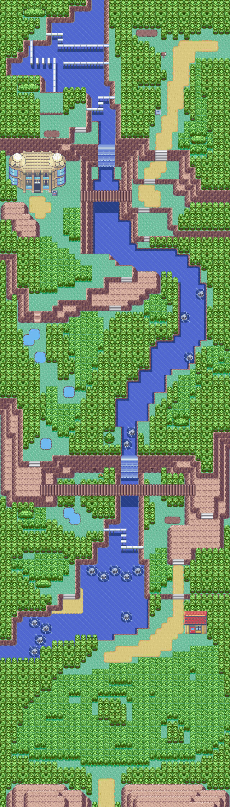
</p>

*<p align="center">Source: https://archives.bulbagarden.net/media/upload/8/83/Hoenn_Route_119_E.png</p>*

Above is Route 119 and Feebas can be found in 6 of the 447 possible fishing tiles.
For this hack, fish tile 447, that will be the lowest row and then the most right (which does not matter because there's only one position on the lowest row):

<p align="center">
  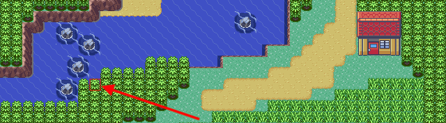
</p>

Yes, right under that tree is a fishing hole, the last hole on the map.
Now get setup like this:

<p align="center">
  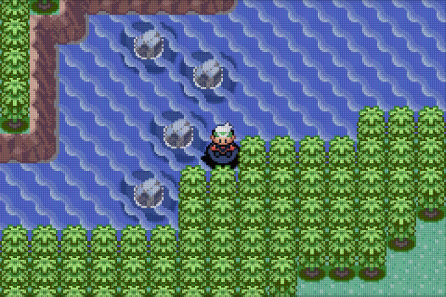
</p>

Go ahead and cast a few times, see what you get:

<p align="center">
  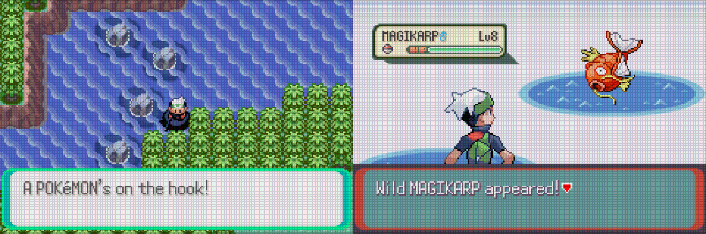
</p>

Next, save and quit (many emulators do not write out the savefile unless you quit).
Now edit the savefile:

```
...
16. Dewford Town Rand: 43605
...

Selection: 16

Current Dewford Town Rand: 43605

New Dewford Town Rand range(0-65535): 0

...
16. Dewford Town Rand: 0
...

Selection: 0

newbag.sav' written out, enjoy!
```

Next, copy `newbag.sav` over your backup'd `Pokemon - Emerald Version (USA, Europe).srm` or `Pokemon - Emerald Version (USA, Europe).sav` savefile, then start up the game.

> If your emulator uses save states, you'll have to reset to load the savefile.

Ok, let's try again:

<p align="center">
  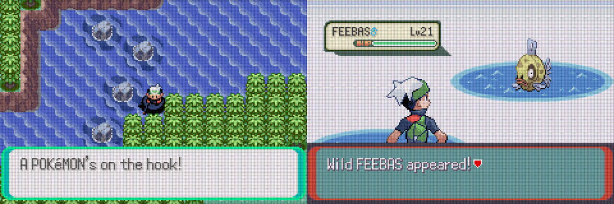
</p>

Don't panic if you do not catch Feebas the first attempt.
It's there with a 50/50 chance, just cast a few more times.


#### Feebas Hack, How Does this Work?

There are 6 locations (of 447 candidate tiles) assigned by a deterministic pseudo random number generator (PRNG) that uses Dewford Trend as a way to generate the random seed.

This code from `src/wild_encounter.c` enables the exploit:

```c
        FeebasSeedRng(gSaveBlock1Ptr->dewfordTrends[0].rand);

        // Assign each Feebas spot to a random fishing spot.
        // Randomness is fixed depending on the seed above.
        for (i = 0; i != NUM_FEEBAS_SPOTS;)
        {
            feebasSpots[i] = FeebasRandom() % NUM_FISHING_SPOTS;
            if (feebasSpots[i] == 0)
                feebasSpots[i] = NUM_FISHING_SPOTS;
```

If the next random number mod the number of spots (447) is zero, then set it to the number of spots, IOW, one of the 6 "random" spots will be spot 447--the last spot on the map.

```c
static u16 FeebasRandom(void)
{
    sFeebasRngValue = ISO_RANDOMIZE2(sFeebasRngValue);
    return sFeebasRngValue >> 16;
}
```

FreebasRandom uses the macro ISO_RANDOMIZER2 (from `include/random.h`):

```c
#define ISO_RANDOMIZE2(val)(1103515245 * (val) + 12345)
```

If we pass a zero as the seed, `ISO_RANDOMIZER2` will return `12345`, however the `sFeebasRngValue >> 16;` statement reduces that to zero giving us an easy win.


### Mirage Island

[_Every day, a random number between 0 and 65535 is generated by the game. If this number matches the first two bytes of the personality value of any Pokémon in the player's party, then Mirage Island will appear._](https://bulbapedia.bulbagarden.net/wiki/Mirage_Island_(Generation_III))

First, get to west side of Route 129.

Now, save and quit (many emulators do not write out the savefile unless you quit).

Next, edit the savefile, and just select `17`, then `0`:

```
...
17. Mirage Island Hack: 63800
...

Selection: 17

...
17. Mirage Island Hack: 33291
...

Selection: 0

newbag.sav' written out, enjoy!
```

Finally, copy `newbag.sav` over your backup'd `Pokemon - Emerald Version (USA, Europe).srm` or `Pokemon - Emerald Version (USA, Europe).sav` savefile, then start up the game.

> If your emulator uses save states, you'll have to reset to load the savefile.

Just head west and you'll bump into Mirage Island.


### Cheats I Did Not Use for the Main Storyline

* Flag Toggles
* Heart Scales to learn any move (I didn't see the point)


## Main Storyline Epilogue

<p align="center">
  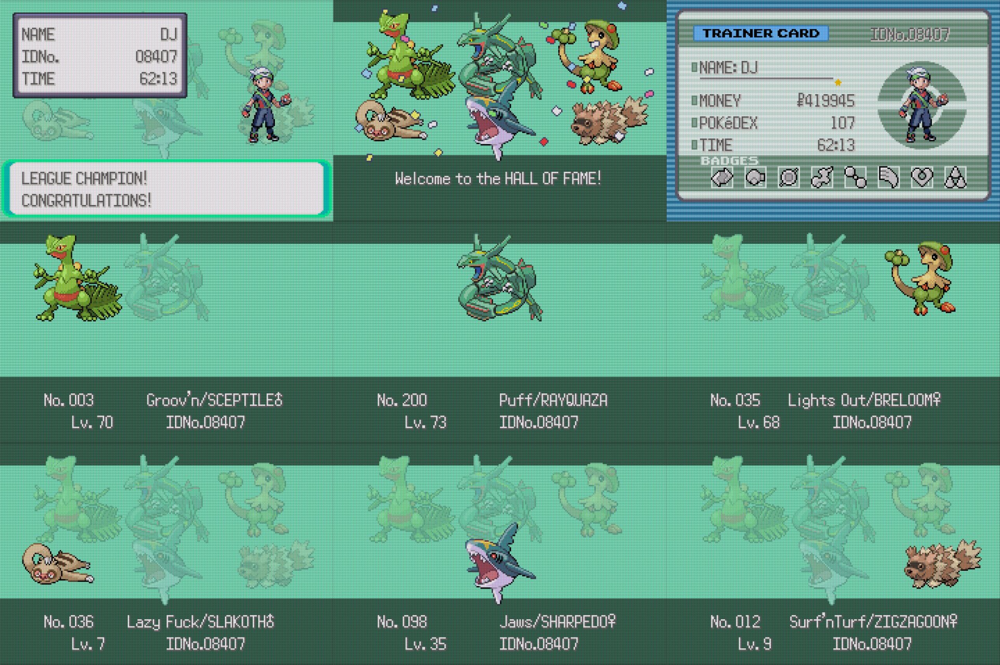
</p>

My final crew post champion status.
The top three did most of the battles, while the bottom provided HM support.
My daughter was amazed Zigzagoon made it to the end (but did not indicate _why_).

Groov'n was my main for almost the entire game until I picked up Puff.
Most of Lights Out level gain came from Exp. Share, however she provided excellent backup when Groov'n was down as well in 2x2 battles.

Game time was reported as 62:13 hours, however leveraging the Retroarch logs:

```
$ grep -l "Pokemon - Emerald Version" retroarch*.log | xargs grep "Content ran for a total of" | awk -F: '{print $NF}' | awk '{h += $1; m += $3; s += $5} END {print h + m/60 + s/3600 }'
26.2978
```

reports the actual wall-clock time as 26.3 hours.
This is clearly due to the use of 4x FF during most trainer and wild battles.
Some of this time was spent testing ideas, redoing sections for screenshots, and my bad habit of using FF as a mute button when I should suspend the game. I do not recall any save scumming.

<p align="center">
  
</p>

The ending credits were fantastic, I should have recorded a video vs. the random screen shots above.
Post the credits you get dumped back into your room where it all started.

<p align="center">
  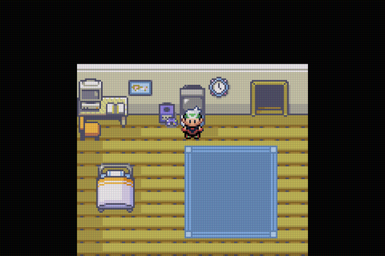
</p>

Filled with all the happiness and sadness of a journey's end, I reflected on my journey and I'd have to say I enjoyed Pokémon Emerald.

[Main Storyline savefile](mainstorylineend.sav)


## Post-Game Epilogue

### Latios and Latias

After the game ends you end up in your room, on the way out you're given a blue pill/red pill choice, pick blue. 

I tried for sometime, following various guides and recommendations, and after a while got board of grinding,
so I added the Latias/Latios hack option to mark both as seen in your Pokédex.
Now you can just hang out in Mauville City and move around in and out of routes while checking the location of Latios.  

<p align="center">
  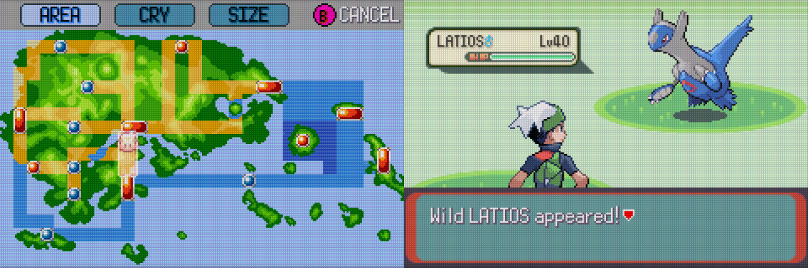
</p>

After you get Latios (should only take a few minutes--watch this [video](https://www.youtube.com/watch?v=D63HfL1ntpU)),
then go back to your room, save and exit, then edit the savefile and toggle flag 2238:

```
...
25. Toggle Flags
...

Selection: 25

Toggle Flag (1-2400) ['0' to Exit]: 2238

Selection: 0

newbag.sav' written out, enjoy!
```

Restart, restore save, and then watch the TV again.
After all that, check your Pokédex if Latias is roaming, it should be, then use same method to catch.
I got both with FF 4x in about 15 minutes.


### Safari Zone

I _tried_ to make effective Pokéblocks.

This is complex and requires reaction times I do not have, so I created an editor:

```
...
12. Pokéblocks
...

Selection: 12

Idx Color      Spicy    Dry  Sweet Bitter   Sour   Feel  Level

 1. Gold           0    255      0      0      0     10    255
 2. Green          0      0      0    255      0     10    255
 3. Red          255      0      0      0      0     10    255
...
40. None           0      0      0      0      0      0      0

Edit block (1-40) ['0' to Exit]: 4

Input block as comma delimited values:

color[0-14], spicy[0-255], dry[0-255], sweet[0-255], bitter[0-255], sour[0-255], feel[0-99]

Colors:

0=None 1=Red 2=Blue 3=Pink 4=Green
5=Yellow 6=Purple 7=Indigo 8=Brown 9=Lite Blue
10=Olive 11=Gray 12=Black 13=White 14=Gold

Set color or entire input to 0 to delete block

[Return] to abort

Block 4: 4, 0, 0, 0, 255, 0, 10

Idx Color      Spicy    Dry  Sweet Bitter   Sour   Feel  Level

 1. Gold           0    255      0      0      0     10    255
 2. Green          0      0      0    255      0     10    255
 3. Red          255      0      0      0      0     10    255
 4. Green          0      0      0    255      0     10    255
...
40. None           0      0      0      0      0      0      0
```

To delete blocks just use `0` when editing a block.

> The list will auto-compact and remove `None` entries, so I just edit `40` each time when in a hurry.

Now that I can create blocks, I just followed this [guide](https://bulbapedia.bulbagarden.net/wiki/Hoenn_Safari_Zone#Pok%C3%A9block_throw_bug) and created green and red blocks to _catch 'em all_.
I have no idea if this is working as intended or not, but this is nothing like my frustring [Red](../pokered/README.md) experience.
I got them all pretty quickly except for the 1% probability Pokémon.
To get the _one percenters_ Quagsire and Octillery I captured the higher probability Wooper and Remoraid then evolved them with Rare Candies.


### Battle Frontier

Save scumming is your friend here.

I did review the data structure from the source and it is by far the most complex and I was too lazy to code up anything to help me out.

You get no in-game experience or Pokémon with these battles,
it's really targeted at those that enjoy the battles IMHO.

The value is probably getting _seen_ Pokémon so you can try to find them?

I grinded out a Silver medal in the _dome_ for the [meatspace] experience:

<p align="center">
  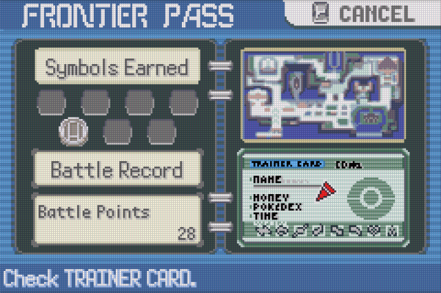
</p>

It was fun, I may revisit some day and _go for the gold_, but I needed to move on and complete my Hoenn dex because I have other projects to start.


### _Gotta catch 'em all:_

```
Selection: 30

Seen: 192  Owned: 148  Regional Seen: 170  Regional Owned: 126

255. H004   S ☐   Torchic     Starter - 1 evo line only
256. H005   S ☐   Combusken   Starter - 1 evo line only
257. H006     ☐   Blaziken    Starter - 1 evo line only
258. H007     ☐   Mudkip      Starter - 1 evo line only
259. H008     ☐   Marshtomp   Starter - 1 evo line only
260. H009     ☐   Swampert    Starter - 1 evo line only
267. H016 Y S ☐   Beautifly   Evolve from 266. H015 Silcoon Level 10
269. H018 Y S ☐   Dustox      Evolve from 268. H017 Cascoon Level 10
272. H021 Y S ☐   Ludicolo    Evolve from 271. H020 Lombre Item WATERSTONE
275. H024 Y S ☐   Shiftry     Evolve from 274. H023 Nuzleaf Item LEAFSTONE
281. H030 Y S ☐   Kirlia      Evolve from 280. H029 Ralts Level 20
282. H031 Y S ☐   Gardevoir   Evolve from 281. H030 Kirlia Level 30
283. H032   S ☐   Surskit     Swarm - Only after record mixing with Ruby/Sapphire
284. H033     ☐   Masquerain  Evolve from 283. H032 Surskit Level 22
288. H037 Y S ☐   Vigoroth    Evolve from 287. H036 Slakoth Level 18
289. H038 Y S ☐   Slaking     Evolve from 288. H037 Vigoroth Level 36
064. H040 Y S ☐   Kadabra     Evolve from 063. H039 Abra Level 16
065. H041     ☐   Alakazam    Trade Evo from 064. H040 Kadabra Trade
291. H043 Y S ☐   Ninjask     Evolve from 290. H042 Nincada Ninjask 20
292. H044 Y   ☐   Shedinja    Evolve from 290. H042 Nincada Shedinja 20
295. H047 Y   ☐   Exploud     Evolve from 294. H046 Loudred Level 40
298. H054 Y S ☐   Azurill     Breed Marill holding Sea Incense
184. H056 Y S ☐   Azumarill   Evolve from 183. H055 Marill Level 18
076. H059     ☐   Golem       Trade Evo from 075. H058 Graveler Trade
299. H060 Y S ☐   Nosepass    Catch
301. H062   S ☐   Delcatty    Evolve - Only 1 Moon Stone (Delcatty or Wigglytuff) from 300. H061 Skitty Item MOONSTONE
169. H065 Y S ☐   Crobat      Evolve from 042. H064 Golbat Happiness
306. H072 Y   ☐   Aggron      Evolve from 305. H071 Lairon Level 42
067. H074 Y S ☐   Machoke     Evolve from 066. H073 Machop Level 28
068. H075   S ☐   Machamp     Trade Evo from 067. H074 Machoke Trade
307. H076   S ☐   Meditite    Trade
308. H077   S ☐   Medicham    Trade
045. H090 Y   ☐   Vileplume   Evolve from 044. H089 Gloom Item LEAFSTONE
182. H091 Y   ☐   Bellossom   Evolve from 044. H089 Gloom Item SUNSTONE
315. H094   S ☐   Roselia     Trade
317. H096 Y   ☐   Swalot      Evolve from 316. H095 Gulpin Level 26
323. H102 Y S ☐   Camerupt    Evolve from 322. H101 Numel Level 33
219. H104 Y   ☐   Magcargo    Evolve from 218. H103 Slugma Level 38
089. H107 Y S ☐   Muk         Evolve from 088. H106 Grimer Level 38
110. H109 Y   ☐   Weezing     Evolve from 109. H108 Koffing Level 35
326. H111 Y   ☐   Grumpig     Evolve from 325. H110 Spoink Level 32
028. H113 Y S ☐   Sandslash   Evolve from 027. H112 Sandshrew Level 22
329. H117 Y   ☐   Vibrava     Evolve from 328. H116 Trapinch Level 35
330. H118 Y S ☐   Flygon      Evolve from 329. H117 Vibrava Level 45
332. H120 Y S ☐   Cacturne    Evolve from 331. H119 Cacnea Level 32
335. H123   S ☐   Zangoose    Trade
337. H125   S ☐   Lunatone    Trade
341. H129 Y   ☐   Corphish    Catch
342. H130 Y S ☐   Crawdaunt   Evolve from 341. H129 Corphish Level 30
346. H134 Y   ☐   Cradily     Evolve from 345. H133 Lileep Level 40
348. H136 Y   ☐   Armaldo     Evolve from 347. H135 Anorith Level 40
174. H137 Y   ☐   Igglybuff   Breed
040. H139 Y S ☐   Wigglytuff  Evolve - Only 1 Moon Stone (Delcatty or Wigglytuff) from 039. H138 Jigglypuff Item MOONSTONE
350. H141 Y S ☐   Milotic     Evolve (High Beauty Level Up) from 349. H140 Feebas Beauty 170
120. H143 Y S ☐   Staryu      Catch
121. H144 Y   ☐   Starmie     Evolve from 120. H143 Staryu Item WATERSTONE
356. H149 Y S ☐   Dusclops    Evolve from 355. H148 Duskull Level 37
038. H154 Y S ☐   Ninetales   Evolve from 037. H153 Vulpix Item FIRESTONE
172. H155 Y   ☐   Pichu       Breed
026. H157 Y   ☐   Raichu      Evolve from 025. H156 Pikachu Item THUNDERSTONE
232. H166 Y   ☐   Donphan     Evolve from 231. H165 Phanpy Level 25
112. H170 Y   ☐   Rhydon      Evolve from 111. H169 Rhyhorn Level 42
362. H172 Y S ☐   Glalie      Evolve from 361. H171 Snorunt Level 42
364. H174 Y S ☐   Sealeo      Evolve from 363. H173 Spheal Level 32
365. H175 Y S ☐   Walrein     Evolve from 364. H174 Sealeo Level 44
367. H177     ☐   Huntail     Trade Evo from 366. H176 Clamperl TradeItem DEEPSEATOOTH
368. H178     ☐   Gorebyss    Trade Evo from 366. H176 Clamperl TradeItem DEEPSEASCALE
171. H182 Y S ☐   Lanturn     Evolve from 170. H181 Chinchou Level 27
117. H185 Y S ☐   Seadra      Evolve from 116. H184 Horsea Level 32
230. H186   S ☐   Kingdra     Trade Evo from 117. H185 Seadra TradeItem DRAGONSCALE
372. H188 Y S ☐   Shelgon     Evolve from 371. H187 Bagon Level 30
373. H189 Y S ☐   Salamence   Evolve from 372. H188 Shelgon Level 50
375. H191 Y   ☐   Metang      Evolve from 374. H190 Beldum Level 20
376. H192 Y   ☐   Metagross   Evolve from 375. H191 Metang Level 45
385. H201     ☐   Jirachi     Event
386. H202     ☐   Deoxys      Event
```

The above is from the `30. Pokédex [Regional] Picklist` option.
Use this to optimize your time.
The last column is the method you'll need and came from this [list](https://gaming.stackexchange.com/questions/331102/how-many-pokemon-can-be-obtained-only-in-emerald).

I was surprised to find that I missed three that I should have caught during the Main Storyline run:

```
299. H060 Y S ☐   Nosepass    Catch
341. H129 Y   ☐   Corphish    Catch
120. H143 Y S ☐   Staryu      Catch
```

Corphish is on me, I could not catch at the time because I needed an improved rod.
I simply forgot.

The [guide](https://bulbapedia.bulbagarden.net/wiki/Appendix:Emerald_walkthrough) I was using is missing a couple of things:

1. https://bulbapedia.bulbagarden.net/wiki/Appendix:Emerald_walkthrough/Section_3 is missing Nosepass, however it is documented here: https://bulbapedia.bulbagarden.net/wiki/Granite_Cave.
1. https://bulbapedia.bulbagarden.net/wiki/Appendix:Emerald_walkthrough/Section_13 is missing Staru, however it is documented here: https://bulbapedia.bulbagarden.net/wiki/Lilycove_City.

> BTW, I'm not criticizing Bulbapedia's work, it's incredible, just pointing out where I had to find the missing information.
When I find time I'll update the Wiki myself.


### Evolutions

I already did the two from the Safari Zone (the 1%, see above), and I continue to just pump them full of Rare Candies to speed this up.

I did learn much about different Pokémon and their moves through this process, I was not blindly accepting or rejecting new moves, but considered each one to best enable my Pokémon.


#### Moon Stones

This [link](https://gaming.stackexchange.com/questions/331102/how-many-pokemon-can-be-obtained-only-in-emerald) there's only one, and I found it, so gave myself another for:

```
301. H062   S ☐   Delcatty    Evolve - Only 1 Moon Stone (Delcatty or Wigglytuff) from 300. H061 Skitty Item MOONSTONE
040. H139 Y S ☐   Wigglytuff  Evolve - Only 1 Moon Stone (Delcatty or Wigglytuff) from 039. H138 Jigglypuff Item MOONSTONE
```

I'm sure the proper way was to get a _friend_ to get the other then trade.


#### Stones

The rest of stones I picked up or converted from sea glass.

```
272. H021 Y S ☐   Ludicolo    Evolve from 271. H020 Lombre Item WATERSTONE
275. H024 Y S ☐   Shiftry     Evolve from 274. H023 Nuzleaf Item LEAFSTONE
045. H090 Y   ☐   Vileplume   Evolve from 044. H089 Gloom Item LEAFSTONE
182. H091 Y   ☐   Bellossom   Evolve from 044. H089 Gloom Item SUNSTONE
121. H144 Y   ☐   Starmie     Evolve from 120. H143 Staryu Item WATERSTONE
038. H154 Y S ☐   Ninetales   Evolve from 037. H153 Vulpix Item FIRESTONE
026. H157 Y   ☐   Raichu      Evolve from 025. H156 Pikachu Item THUNDERSTONE
```

#### Beauty Level Up with Pokéblock

```
350. H141 Y S ☐   Milotic     Evolve (High Beauty Level Up) from 349. H140 Feebas Beauty 170
```

Using the Pokéblocks hack above I created this gold block:

```
 1. Gold           0    255      0      0      0     10    255
```

After that, just feed to Milotic, then level up with Rare Candy to evolve.


#### Get Happy or Get Lost

```
169. H065 Y S ☐   Crobat      Evolve from 042. H064 Golbat Happiness
```

Apperently Crobat is cranky and needs to be very happy, so I created the Friendship edit option:

```
Selection: 23

Select Pokémon to Change Friendship:

0. Return
1. Rayquaza   Puff        141
2. Sceptile   Groov'n     255
3. Breloom    Lights Out  255
4. Sharpedo   Jaws        229
5. Golbat     GOLBAT       70

Selection: 5

Friendship (1-255) ['0' to Exit]: 255

Select Pokémon to Change Friendship:

0. Return
1. Rayquaza   Puff        141
2. Sceptile   Groov'n     255
3. Breloom    Lights Out  255
4. Sharpedo   Jaws        229
5. Golbat     GOLBAT      255

Selection: 0
```

> I was initially tempted to just grind this out the proper way, but I needed an excuse to see if I could actually edit the encrypted Pokémon data structure encrypted block.

> If you're wondering why Puff is not that happy I speculate it's because he's was stuff in a box while I was at Battle Frontier.
Puff was not allowed to compete.

#### Ninjask and Shedinja

```
291. H043 Y S ☐   Ninjask     Evolve from 290. H042 Nincada Ninjask 20
292. H044 Y   ☐   Shedinja    Evolve from 290. H042 Nincada Shedinja 20
```

I just followed this [guide](https://www.youtube.com/watch?v=f7vf67eFU98).


#### Forced Rare Candies

```
267. H016 Y S ☐   Beautifly   Evolve from 266. H015 Silcoon Level 10
269. H018 Y S ☐   Dustox      Evolve from 268. H017 Cascoon Level 10
281. H030 Y S ☐   Kirlia      Evolve from 280. H029 Ralts Level 20
282. H031 Y S ☐   Gardevoir   Evolve from 281. H030 Kirlia Level 30
288. H037 Y S ☐   Vigoroth    Evolve from 287. H036 Slakoth Level 18
289. H038 Y S ☐   Slaking     Evolve from 288. H037 Vigoroth Level 36
064. H040 Y S ☐   Kadabra     Evolve from 063. H039 Abra Level 16
295. H047 Y   ☐   Exploud     Evolve from 294. H046 Loudred Level 40
184. H056 Y S ☐   Azumarill   Evolve from 183. H055 Marill Level 18
306. H072 Y   ☐   Aggron      Evolve from 305. H071 Lairon Level 42
067. H074 Y S ☐   Machoke     Evolve from 066. H073 Machop Level 28
317. H096 Y   ☐   Swalot      Evolve from 316. H095 Gulpin Level 26
323. H102 Y S ☐   Camerupt    Evolve from 322. H101 Numel Level 33
219. H104 Y   ☐   Magcargo    Evolve from 218. H103 Slugma Level 38
089. H107 Y S ☐   Muk         Evolve from 088. H106 Grimer Level 38
110. H109 Y   ☐   Weezing     Evolve from 109. H108 Koffing Level 35
326. H111 Y   ☐   Grumpig     Evolve from 325. H110 Spoink Level 32
028. H113 Y S ☐   Sandslash   Evolve from 027. H112 Sandshrew Level 22
329. H117 Y   ☐   Vibrava     Evolve from 328. H116 Trapinch Level 35
330. H118 Y S ☐   Flygon      Evolve from 329. H117 Vibrava Level 45
332. H120 Y S ☐   Cacturne    Evolve from 331. H119 Cacnea Level 32
342. H130 Y S ☐   Crawdaunt   Evolve from 341. H129 Corphish Level 30
346. H134 Y   ☐   Cradily     Evolve from 345. H133 Lileep Level 40
348. H136 Y   ☐   Armaldo     Evolve from 347. H135 Anorith Level 40
356. H149 Y S ☐   Dusclops    Evolve from 355. H148 Duskull Level 37
232. H166 Y   ☐   Donphan     Evolve from 231. H165 Phanpy Level 25
112. H170 Y   ☐   Rhydon      Evolve from 111. H169 Rhyhorn Level 42
362. H172 Y S ☐   Glalie      Evolve from 361. H171 Snorunt Level 42
364. H174 Y S ☐   Sealeo      Evolve from 363. H173 Spheal Level 32
365. H175 Y S ☐   Walrein     Evolve from 364. H174 Sealeo Level 44
171. H182 Y S ☐   Lanturn     Evolve from 170. H181 Chinchou Level 27
117. H185 Y S ☐   Seadra      Evolve from 116. H184 Horsea Level 32
372. H188 Y S ☐   Shelgon     Evolve from 371. H187 Bagon Level 30
373. H189 Y S ☐   Salamence   Evolve from 372. H188 Shelgon Level 50
375. H191 Y   ☐   Metang      Evolve from 374. H190 Beldum Level 20
376. H192 Y   ☐   Metagross   Evolve from 375. H191 Metang Level 45
```

Nothing really to explain here.
Gave myself Rare Candies to move this along.


#### Trading Evolution

```
065. H041     ☐   Alakazam    Trade Evo from 064. H040 Kadabra Trade
076. H059     ☐   Golem       Trade Evo from 075. H058 Graveler Trade
068. H075   S ☐   Machamp     Trade Evo from 067. H074 Machoke Trade
```

Time for some trade-scumming.
Just trade back and forth for evolution.
Evolution happens inbound to the receiving device.

> I did not know what would have happened if I used the same savefile on both devices, and I was getting short on time for this project, so I downloaded a savefile for the second device, more on this below.

Using two RG35XXSP with muOS, Retroarch Netplay, and the gpSP core:


It is always remarkable how well this works, and it never gets old.
Amazing!

That said, it did error out in the most retro way possible,
which just added to the experience in a positive way--I got to experience the worry of an unexpected disconnection:

<p align="center">
  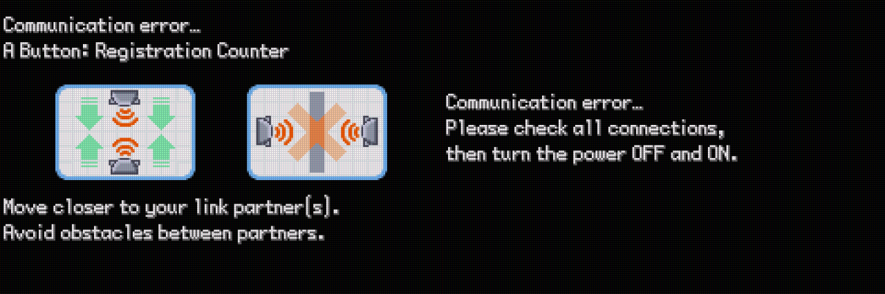
</p>

The first error is easy to repeat;
if the _Link Leader_ exits first the other members get that error.

The second error just "happened" on the _Leader_ device after a long session of trades causing the other side to hang, I'll admit I was worried about savefile corruption, but all was fine, I just needed to reset each, reload the savefile and get to back to trading.


#### Trading Evolution with Items

```
367. H177     ☐   Huntail     Trade Evo from 366. H176 Clamperl TradeItem DEEPSEATOOTH
368. H178     ☐   Gorebyss    Trade Evo from 366. H176 Clamperl TradeItem DEEPSEASCALE
230. H186   S ☐   Kingdra     Trade Evo from 117. H185 Seadra TradeItem DRAGONSCALE
```

No different that any other trade-scum, just need to have each Pokémon be holding a specific item.

> Tale of the Dragon Scale
>
>I know I found this, I knew I had it, but I could not remember what I did with it, it's not in my items or PC.
Did I give it to an NPC for something?
>
>After some research it was clear I never had it, at least not in this Pokémon game.
That is the problem with trying to speed through three generations of Pokémon RPGs in three months as a Summer project.
Events get conflated, especially since the games are so similar.
>
>Apparently there's a 1 in 5 chance a Bagon you encounter will be holding one and my Bagon's pockets were empty. So, I just gave it to myself--no time to chase one down the proper way.


### Breading

```
298. H054 Y S ☐   Azurill     Breed Marill holding Sea Incense
174. H137 Y   ☐   Igglybuff   Breed
172. H155 Y   ☐   Pichu       Breed
```

> Lesson learned, breed first before doing evolutions, now I need to find more Pokémons.

No cheating here other than FF 4x on the Mach bike back and forth from route 117 to 118 through Mauville City.

I did start to research a step hack like I did with Soot Sack Steps, however it did not take that long to breed or hatch with FF 4x and the Mach bike.


### Trades: _Gotta ~~catch~~ download 'em all_

```
Selection: 30

Seen: 217  Owned: 209  Regional Seen: 195  Regional Owned: 187

255. H004   S ☐   Torchic     Starter - 1 evo line only
256. H005   S ☐   Combusken   Starter - 1 evo line only
257. H006     ☐   Blaziken    Starter - 1 evo line only
258. H007     ☐   Mudkip      Starter - 1 evo line only
259. H008     ☐   Marshtomp   Starter - 1 evo line only
260. H009     ☐   Swampert    Starter - 1 evo line only
283. H032   S ☐   Surskit     Swarm - Only after record mixing with Ruby/Sapphire
284. H033     ☐   Masquerain  Evolve from 283. H032 Surskit Level 22
307. H076   S ☐   Meditite    Trade
308. H077   S ☐   Medicham    Trade
315. H094   S ☐   Roselia     Trade
335. H123   S ☐   Zangoose    Trade
337. H125   S ☐   Lunatone    Trade
385. H201     ☐   Jirachi     Event
386. H202     ☐   Deoxys      Event
```

This was the remaining missing Pokémon, and there was no way to get other than trading or flat out editing the savefile and just putting in there.
I opted for trading.

I Googled for a completed savefile and found [this](https://projectpokemon.org/home/forums/topic/37598-pokemon-emerald-save-file-with-all-shiny-pokemon/) (thanks NICK!)

Not only is this complete, but it is in order as well saving me time.
They are also all _shiny_.
The significance of that escapes me.

I conscripted 15 wild Pokémon to use a trade fodder (I was not going to give up _my_ Pokémon :-), then started trading with _virtual NICK_--my only Emerald friend.


## Epilogue

<p align="center">
  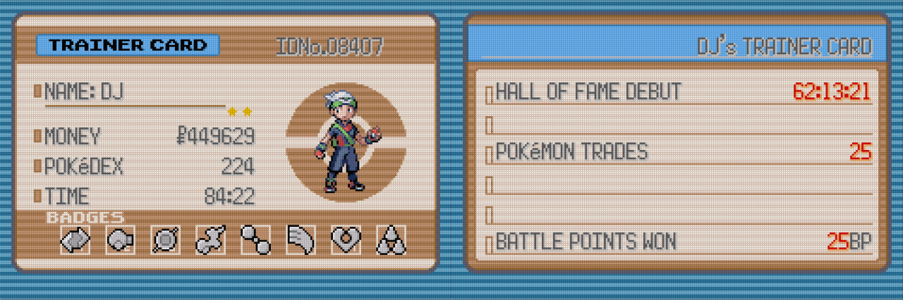
</p>

84:22 hours game time, however wall-clock time was 37.51 hours.
I used FF 4x for most of the post-game except for the trading because I thoroughly enjoyed that.
Other parts that were new experiences, e.g. breeding, I also did not FF the first time.


### Diplomas

My diploma for _catching 'em all:_

<p align="center">
  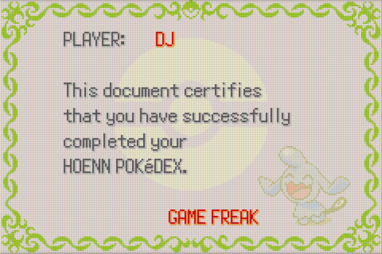
</p>

I talked to just about every NPC, I do not recall missing any, nor do I recall any NPC stating that post-game the Game Freak development team would be vacationing in Lilycove City.
Information required if you want to get your diploma.

There's a National Pokédex diploma as well.
That is just too much trading, so I'll have to take the loss on that one.


### Secret Bases

I did not see the point at all.
I guess it's just a fun side element of the game.
They would have been more useful in the field if I had access to all PCs.
Clearly I have a mobile phone because other trainers keep calling me and the worst possible times,
dunno why I cannot have a laptop as well.


### Battle Frontier

Cool.
Just no time.
May review in the distant, very distant, future.


### Pokémon Emerald 386

This [ROM hack](https://www.romhacking.net/hacks/8787/) ([alternative location](https://archive.org/download/romhacking.net-20240801/rhdn_20240801.zip/hacks%2Fgba%2Fpatches%2F%5B8787%5DPokemon%20Emerald%20386%20%28v1.0%29.zip)) released while I was already mid-main storyline and the savefile state could not be used and I did not have the time to start over.

If I ever play Emerald again I'll be using this version since it enables the catching of all Pokémon.

I did confirm my save editor for Emerald works with this ROM hack, however flags may be incorrectly labeled and extensive testing has not be done. And, the "obtainable" indicator in the Pokédex dumps is clearly in correct since all are obtainable.  When/if I play this version I'll update my code.


### Final Thoughts

Great game.
I highly recommend it and I enjoyed it.
I still think [Polished Crystal](https://github.com/Rangi42/polishedcrystal) is peak Pokémon, however having just stared researching my final _mon_ ([Pokémon Unbound](https://www.pokecommunity.com/threads/pok%C3%A9mon-unbound-completed.382178/), honor mode), [Polished Crystal](https://github.com/Rangi42/polishedcrystal) could fall in second place, however I will not make that call until the [9-bit version of Polished Crystal](https://github.com/Rangi42/polishedcrystal/tree/9bit) is released and I do an honor playthrough.

Both [Polished Crystal](https://github.com/Rangi42/polishedcrystal) and [Unbound](ttps://www.pokecommunity.com/threads/pok%C3%A9mon-unbound-completed.382178/) correct numerous issues that enhance game play and reduces toil.


