# Pokemon Red Postmortem (with cheat code)

*<p style="text-align: center;"><br>[2024 is the first time I have played Game Boy or Pokémon games.<br>
FF and save file editing to reduce the toil is a must for me.<br>
I'm not a 10-year-old kid with unlimited time on my hands, and who am I going to trade with?<br>
-- datajerk<br><br>](https://www.reddit.com/r/AnaloguePocket/comments/1e9pc0g/comment/legxrj2/)</p>*


> If you're just looking for the cheat code, then [here it is](./preditor.py);
it should be pretty easy to figure out.
Below was my thought process and evolution of the script with examples.
This isn't a comprehensive savefile editor, just what I needed for my playthrough.
Enjoy!

## Objective

I consider myself more of a game researcher than a gamer.
My objective was to experience Pokémon Red as quickly as possible without hours of repeated toil.
This was my second Pokémon playthrough, my first was [Polished Crystal (3.0.0-beta)](https://github.com/Rangi42/polishedcrystal) and I highly recommend it (you've not lived until defeating _Robomon_).
I played [Polished Crystal](https://github.com/Rangi42/polishedcrystal) faithfully (no save scumming either) through the main story and defeated Lance and the Elite Four on a single pass (post game was [entirely different](https://github.com/datajerk/gamenotes/blob/main/polishedcrystal/ppcshoplift/README.md)).
It was enjoyable and [Polished Crystal](https://github.com/Rangi42/polishedcrystal) has on store shelves everything you need to reduce the toil of the game--I've had my "Honor Mode" run of Pokémon.
However, I didn't _catch 'em all_ (I didn't even try).

For Red I wanted the _full_ experience, so _catching 'em all_ was necessary.
[HowLongToBeat Pokémon Red and Blue](https://howlongtobeat.com/game/7169) reports 101 hours; I just did not have that time--fast-forward and some light cheating was required.


## Tools and Resources

* Black [Analogue Pocket](https://www.analogue.co/pocket) (firmware 2.2), managed with [pupdate](https://github.com/mattpannella/pupdate).
* [Game Boy Color for Analogue Pocket core](https://github.com/budude2/openfpga-GBC) versions 1.2.*x*.
This core provides fast-forward (FF) (about 3x)--required for grinding through the weeds and trainer battles.
FF can be configured to disable audio as well which is very nice.
This core, at this time, does not have save states.
Fortunately, you can save just about anywhere at anytime, however, saves are not enumerated like save states which requires me USB-C connect the Pocket and run my backup script that will enumerate the save for me--usually an end-of-session or end-of-event activity.
* The [SameBoy](https://sameboy.github.io/) emulator for MacOS was used when I needed much faster fast-forward (Safari Zone save scumming).
* An authentic Pokémon Red Game Boy Game Pak cartridge ripped with [GB Operator](https://www.epilogue.co/product/gb-operator); I wanted to test if my altered savefiles could be uploaded to a cart--they can!
* [Pokemon Red (and Blue) Full Color Hack](https://www.romhacking.net/hacks/1385/), looks _soooo_ so good on the Analogue Pocket, and the savefile format is the same.
I did have one beef with this hack I'll chronicle at the end.
* https://github.com/pret/pokered, I mostly used this gather the list of the wild Pokémon in each area so I that did not miss any--I needed to know when to stop grinding.
* https://bulbapedia.bulbagarden.net/wiki/Save_data_structure_(Generation_I), my guide for writing cheat code.
* [Nintendo Power 1998 - Pokemon Red & Blue.pdf](https://archive.org/download/NintendoPower1998PokemonRedBlue/%28Nintendo%20Power%201998%29%20-%20Pokemon%20Red%20%26%20Blue.pdf), my guide so that I did not miss anything.  However, I did not follow it blindly, more like a museum pamphlet, but also a checklist of the 150 (until I added the Pokédex to my script).
* https://bulbapedia.bulbagarden.net/wiki/Appendix:Red_and_Blue_walkthrough, my backup guide, mostly used post-game to find the in-game trades.


## Cheating

Main Story Guidelines:

1. No altering money (but coins ok, something I learned from my Polished Crystal post-game run).
1. No Rare Candy to level up.
1. Must "capture" each Pokémon the way the game intended (with a ball).
1. No glitches (mostly concerned about savefile corruption).

Post Game Guidelines:

1. Experience the proper way at least once.
   1. Grinding
   1. Meatspace trading
   1. Evolution (stones and grinding)
   1. etc...
1. No glitches (mostly concerned about savefile corruption)


### Cheat Code

I wrote a small Python CLI tool called [preditor.py](preditor.py) (*P*okémon *R*ed *editor*), and it should run on any Mac, Windows, or Linux platform with `python3 preditor.py [filename.sav]`.

> I'll cover the features mostly in the order I developed them and explain the need.


### Non-cheating QoL options

```
Main Menu

0.  Exit (and [over]write "newpack.sav")
1.  Items
2.  Sort Items
3.  Box Items
4.  Sort Box Items
5.  Edit ID: 52781
6.  Edit Protagonist Name: DJ
7.  Edit Rival Name: Gary
8.  Edit Money: 247138
9.  Edit Coins: 6299
10. Edit Pikachu Friendship (Yellow): 0
11. Edit Wild Pokémon Table
12. Edit Surf Pokémon Table
13. Edit Party Names
14. Edit Play Time: 42:06:32:46
15. Toggle Events
16. Bill's PC [by box] (read only)
17. Bill's PC [by name] (read only)
18. Pokédex (read only)
19. Hall of Fame (read only)
20. [Over]write "newpack.sav" and continue editing
21. Abort! (all changes since last write lost)
```

Without cheating this tool is useful for listing/sorting items, listing your Pokédex, Events, Hall of Fame, the contents of Bill's PC, and editing names and your ID.

Most of this should be self-explanatory, but I'll cover a few notable items.


#### The Pokédex

The Pokédex has an additional field that is not present in game:

```
Seen: 151 Owned: 151

001. S ☐ ◓ Bulbasaur 	063. S ■ ◓ Abra
002. S ☐ ◓ Ivysaur   	142. S ■ ◓ Aerodactyl
003. S ■ ◓ Venusaur  	065. S ■ ◓ Alakazam
004. S ☐ ◓ Charmander	024. S ■ ◓ Arbok
005. S ☐ ◓ Charmeleon	059. S ■ ◓ Arcanine
006. S ● ◓ Charizard 	144. S ● ◓ Articuno
...
```

`S` is seen, and `◓` is _has owned_, not _own_.
As a Pokémon n00b this confused me until after I did my first post-game trade.
You still get credit if you have ever _owned_ a Pokémon, but you do not need to keep in your inventory (party or Bill's PC).
This ignorance kept me from trading in-game until the end when I started to _catch 'em all_.
I also ended up with some dups in Bill's PC for the specific purpose of trading.

The `■` (filled box) indicates you are in possession of that Pokémon within Bill's PC.

The `●` (filled circle) indicates you have possession of that Pokémon in your party.

You can probably guess why I have a Venusaur but _had owned_ a Bulbasaur at one time--evolution.


#### Toggle Events

The completionist may find the Events toggle useful:

```
0001 ■ FOLLOWED_OAK_INTO_LAB
0004 ☐ HALL_OF_FAME_DEX_RATING
0007 ☐ PALLET_AFTER_GETTING_POKEBALLS
0025 ■ GOT_TOWN_MAP
0026 ■ ENTERED_BLUES_HOUSE
...
0105 ☐ BOUGHT_MUSEUM_TICKET
...
0264 ☐ IN_PURIFIED_ZONE
...
0570 ■ GAVE_GOLD_TEETH
0591 ☐ SAFARI_GAME_OVER
0592 ☐ IN_SAFARI_ZONE
0601 ■ GOT_TM06
...
0728 ■ GOT_TM35
0737 ☐ GAVE_FOSSIL_TO_LAB
0738 ☐ LAB_STILL_REVIVING_FOSSIL
0739 ☐ LAB_HANDING_OVER_FOSSIL_MON
0833 ■ GOT_TM31
...
1407 ☐ GOT_DOME_FOSSIL
1408 ■ GOT_HELIX_FOSSIL
...
0855 ■ GOT_HITMONLEE
0856 ☐ GOT_HITMONCHAN
...
2242 ■ BEAT_MEWTWO
2274 ☐ BEAT_LORELEIS_ROOM_TRAINER_0
2279 ☐ AUTOWALKED_INTO_LORELEIS_ROOM
2282 ☐ BEAT_BRUNOS_ROOM_TRAINER_0
2287 ☐ AUTOWALKED_INTO_BRUNOS_ROOM
2290 ☐ BEAT_AGATHAS_ROOM_TRAINER_0
2295 ☐ AUTOWALKED_INTO_AGATHAS_ROOM
2298 ☐ BEAT_LANCES_ROOM_TRAINER_0
2303 ☐ BEAT_LANCE
2304 ☐ LANCES_ROOM_LOCK_DOOR
2306 ☐ BEAT_CHAMPION_RIVAL
2322 ■ BEAT_VICTORY_ROAD_1_TRAINER_0
```

There's room for 2560 events however there are not that many defined.

I would not get too worked up if you cannot check all of these because some of these reset.  E.g. I did best the Elite Four and Gary (rival), but I think the bits are reset for a future run--the Hall of Fame supports 50 wins!

>When I dumped the save from my used cart I was disappointed there wasn't a long history of wins and trades.
It would have been great to capture and review some of that history.

The fossil/lab/mon and Safari events are probably status flags and do not indicate event completion, and I'm 99% sure I did purchase a museum ticket, but I think I declined to purchase a second time.

The purified zone I'm sure is set when you're on it and reset when you leave.

There are a number of trainer battles flagged as not completed.
I tried to be thorough and _fight 'em all_, but I may have missed a few due to fatigue, but the list indicates far more that I can imagine missing.
I may in the future revisit the noted areas and try to pick a fight, OTOH it could just be erroneous, perhaps the designers decided to reduce the number of trainer battles in some areas.

Hitmonlee/Hitmonchan as well as Dome/Helix Fossils are binary decisions--you get one or the other, and there's no _legit_ way without trading to change this.  However...

Reset the bit from:

```
0855 ■ GOT_HITMONLEE
0856 ☐ GOT_HITMONCHAN
```

To:

```
0855 ☐ GOT_HITMONLEE
0856 ☐ GOT_HITMONCHAN
```

Then this outcome:

<p align="center">
  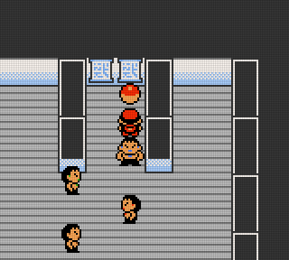
  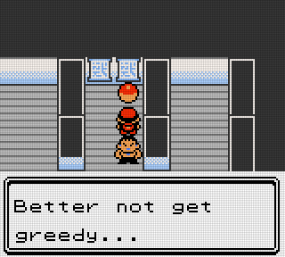
</p>

Becomes:

<p align="center">
  
  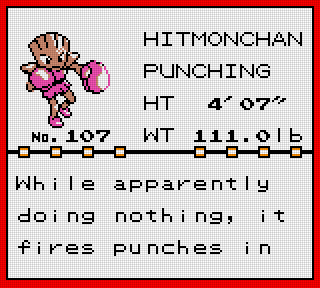
</p>

> Interestingly only one ball is present.
If I had to guess, it's because I _owned_ or have in my inventory Hitmonlee--an exercise for another to verify.


### Master Balls, Max Elixir, and Full Restore

My plan was to play faithfully until I purchased a ball and captured my first Pokémon, after that I gave myself 99 Master Balls, Max Elixir, and Full Restore.

I did not see the point in beating a Pokémon within an inch of its life just to capture it--if they faint, then just scoop them up in a ball and move on.
I understand it's the game designers forcing function to form a party with strong and weak members, and that alone may force a different challenge with trainer battles ([HMs](https://bulbapedia.bulbagarden.net/wiki/HM) also force party skill diversity).
On my [Polished Crystal](https://github.com/Rangi42/polishedcrystal) run I had no desire to _catch 'em all_; just to complete the main story line, so I just captured the strong and defeated the weak.
However, my intent with Red was to _catch 'em all_, and to save time I used Master Balls.

> One could argue that a more experience combatant (e.g. a martial art instructor) can weaken an opponent more effectively because they have experience at all levels of combat,
whereas a n00b may be unable to exercise restraint and kill their opponent unintentionally.

Max Elixir and Full Restore are the equivalent of visiting a Pokémon center, but in the field.
No need to turn around to top off.
Again, trying to save time, but still get the story experience.

> The one area where you cannot backtrack to center is once you've started your Elite Four run, however you can buy at the center just before your run as many Max Potions, Full Restore, and Revive as you can carry, which is all you'll need.

Use the `Items` or `Box Items` option and add what you need:

```
Items Menu (Select Items to Edit, 17 of 20 array elements assigned

  0. Return                   47. Leaf Stone:         0    94. TM06 Toxic:         0
  1. Master Ball:       44    48. Card Key:           0    95. TM07 Horn Drill:    0
  2. Ultra Ball:         0    49. Nugget:             0    96. TM08 Body Slam:     0
  3. Great Ball:         0    50. PP Up*:             0    97. TM09 Take Down:     0
  4. Poké Ball:          0    51. Poké Doll:          0    98. TM10 Double-Edge:   0
  5. Town Map:           1    52. Full Heal:          0    99. TM11 BubbleBeam:    0
  6. Bicycle:            1    53. Revive:             0   100. TM12 Water Gun:     0
  7. ?????:              0    54. Max Revive:         0   101. TM13 Ice Beam:      0
  8. Safari Ball:        0    55. Guard Spec.:        0   102. TM14 Blizzard:      0
  9. Pokédex:            0    56. Super Repel:        0   103. TM15 Hyper Beam:    0
 10. Moon Stone:         0    57. Max Repel:         77   104. TM16 Pay Day:       0
 11. Antidote:           0    58. Dire Hit:           0   105. TM17 Submission:    1
 12. Burn Heal:          0    59. Coin:               0   106. TM18 Counter:       0
 13. Ice Heal:           0    60. Fresh Water:        0   107. TM19 Seismic Toss:  0
 14. Awakening:          0    61. Soda Pop:           0   108. TM20 Rage:          0
 15. Parlyz Heal:        0    62. Lemonade:           0   109. TM21 Mega Drain:    0
 16. Full Restore:      65    63. S.S. Ticket:        0   110. TM22 SolarBeam:     0
 17. Max Potion:         0    64. Gold Teeth:         0   111. TM23 Dragon Rage:   0
 18. Hyper Potion:       0    65. X Attack:           0   112. TM24 Thunderbolt:   0
 19. Super Potion:       0    66. X Defend:           0   113. TM25 Thunder:       0
 20. Potion:             0    67. X Speed:            0   114. TM26 Earthquake:    0
 21. BoulderBadge:       0    68. X Special:          0   115. TM27 Fissure:       0
 22. CascadeBadge:       0    69. Coin Case:          0   116. TM28 Dig:           0
 23. ThunderBadge:       0    70. Oak's Parcel:       0   117. TM29 Psychic:       0
 24. RainbowBadge:       0    71. Itemfinder:         1   118. TM30 Teleport:      0
 25. SoulBadge:          0    72. Silph Scope:        0   119. TM31 Mimic:         0
 26. MarshBadge:         0    73. Poké Flute:         1   120. TM32 Double Team:   0
 27. VolcanoBadge:       0    74. Lift Key:           0   121. TM33 Reflect:       0
 28. EarthBadge:         0    75. Exp. All:           0   122. TM34 Bide:          0
 29. Escape Rope:       19    76. Old Rod:            1   123. TM35 Metronome:     0
 30. Repel:              0    77. Good Rod:           1   124. TM36 Selfdestruct:  0
 31. Old Amber:          0    78. Super Rod:          1   125. TM37 Egg Bomb:      0
 32. Fire Stone:         0    79. PP Up:              0   126. TM38 Fire Blast:    0
 33. Thunderstone:       0    80. Ether:              0   127. TM39 Swift:         0
 34. Water Stone:        0    81. Max Ether:          0   128. TM40 Skull Bash:    0
 35. HP Up:              0    82. Elixer:             0   129. TM41 Softboiled:    1
 36. Protein:            0    83. Max Elixer:        87   130. TM42 Dream Eater:   0
 37. Iron:               0    84. HM01 Cut:           0   131. TM43 Sky Attack:    0
 38. Carbos:             0    85. HM02 Fly:           0   132. TM44 Rest:          0
 39. Calcium:            0    86. HM03 Surf:          0   133. TM45 Thunder Wave:  0
 40. Rare Candy:        20    87. HM04 Strength:      0   134. TM46 Psywave:       0
 41. Dome Fossil:        0    88. HM05 Flash:         0   135. TM47 Explosion:     1
 42. Helix Fossil:       0    89. TM01 Mega Punch:    0   136. TM48 Rock Slide:    0
 43. Secret Key:         0    90. TM02 Razor Wind:    0   137. TM49 Tri Attack:    0
 44. ?????:              0    91. TM03 Swords Dance:  0   138. TM50 Substitute:    0
 45. Bike Voucher:       0    92. TM04 Whirlwind:     0
 46. X Accuracy:         0    93. TM05 Mega Kick:     1

Selection: 1

Quantity (1-99): 99
```

> This list comes from [here](https://bulbapedia.bulbagarden.net/wiki/List_of_items_by_index_number_(Generation_I)), and some of these items do not make sense, e.g. Safari Balls, there is actually a different counter for that specific to that area of the game; the badges are actually a bit array elsewhere and I have no idea what will happen if you try to edit these--probably nothing.

If you set any quantity to zero, it'll delete from your pack/PC.


### Money and Coins

```
Current Coins: 6299

New Coins range(0-9999):
```

> I only added the ability to change Money because it was easy after writing the code to change the coins.  I considered a feature that would actually reduce your funds based on what items you added, but never got around to it.

There's a casino in Red, and it's a complete waste of time and money like any casino.
This was the case with [Polished Crystal](https://github.com/Rangi42/polishedcrystal) as well, and I could not find a way in [Polished Crystal](https://github.com/Rangi42/polishedcrystal) to _game_ the system, and therefore assumed that Red had no such option either for quick gains, so I added the ability to give coins to later redeem for Pokémon.

To redeem the Blue only Pokémon I booted up Blue with my Red save and purchased with coins the Blue only Pokémon.  _Gotta ~~catch~~ buy 'em all._

> Your savefile can be moved between Red, Blue, Yellow without any issues AFAIK--I have had none.


### Wild and Surf Edit

I thought I was done with my cheat code until the Safari Zone.

The Safari Zone issues you 30 Safari Balls (the only balls you can use), and you get about 500 moves before you're ejected from the park.
No worries, you can just reenter for a small fee (500円) and receive a new set of 30 balls and 500 moves.

When you encounter a wild Pokémon you have only four options as a trainer, _throw a ball_, _throw a rock_ (to increase the odds a ball will capture if the Pokémon is still there), _bait_ (will keep them around but reduce the odds of a ball catch), or just _run_.

> Google how to beat the Safari Zone, and you'll find endless stories of frustration and Nintendo handhelds flying across rooms.

The good news is for some reason the list of wilds and their probability distribution are stored in the savefile (this is also the root cause of some of the exploitable glitches).

There is a different table for walking wild and surfing wild Pokémons.
But the format is the same; an array of Level:Species ID pairs.

> The surf table is always the same, its 100% Tentacool.
I bet you already figured that out.  NOTE: the fishing table AFAIK is NOT in the savefile.

```
Current Wild Table:

L025 Nidoran♂    25%
L026 Doduo       15%
L023 Venonat     15%
L024 Exeggcute   10%
L033 Nidorino    10%
L026 Exeggcute   10%
L025 Nidoran♀     5%
L031 Venomoth     5%
L026 Tauros       4%
L028 Kangaskhan   1%

Current Wild Rate:

Nidoran♂    25       25%
Exeggcute   24, 26   20%
Doduo       26       15%
Venonat     23       15%
Nidorino    33       10%
Nidoran♀    25        5%
Venomoth    31        5%
Tauros      26        4%
Kangaskhan  28        1%

Select next Wild Pokémon:

  0. Return       31. Nidoqueen    62. Poliwrath    93. Haunter     124. Jynx
  1. Bulbasaur    32. Nidoran♂     63. Abra         94. Gengar      125. Electabuzz
  2. Ivysaur      33. Nidorino     64. Kadabra      95. Onix        126. Magmar
  3. Venusaur     34. Nidoking     65. Alakazam     96. Drowzee     127. Pinsir
  4. Charmander   35. Clefairy     66. Machop       97. Hypno       128. Tauros
  5. Charmeleon   36. Clefable     67. Machoke      98. Krabby      129. Magikarp
  6. Charizard    37. Vulpix       68. Machamp      99. Kingler     130. Gyarados
  7. Squirtle     38. Ninetales    69. Bellsprout  100. Voltorb     131. Lapras
  8. Wartortle    39. Jigglypuff   70. Weepinbell  101. Electrode   132. Ditto
  9. Blastoise    40. Wigglytuff   71. Victreebel  102. Exeggcute   133. Eevee
 10. Caterpie     41. Zubat        72. Tentacool   103. Exeggutor   134. Vaporeon
 11. Metapod      42. Golbat       73. Tentacruel  104. Cubone      135. Jolteon
 12. Butterfree   43. Oddish       74. Geodude     105. Marowak     136. Flareon
 13. Weedle       44. Gloom        75. Graveler    106. Hitmonlee   137. Porygon
 14. Kakuna       45. Vileplume    76. Golem       107. Hitmonchan  138. Omanyte
 15. Beedrill     46. Paras        77. Ponyta      108. Lickitung   139. Omastar
 16. Pidgey       47. Parasect     78. Rapidash    109. Koffing     140. Kabuto
 17. Pidgeotto    48. Venonat      79. Slowpoke    110. Weezing     141. Kabutops
 18. Pidgeot      49. Venomoth     80. Slowbro     111. Rhyhorn     142. Aerodactyl
 19. Rattata      50. Diglett      81. Magnemite   112. Rhydon      143. Snorlax
 20. Raticate     51. Dugtrio      82. Magneton    113. Chansey     144. Articuno
 21. Spearow      52. Meowth       83. Farfetch'd  114. Tangela     145. Zapdos
 22. Fearow       53. Persian      84. Doduo       115. Kangaskhan  146. Moltres
 23. Ekans        54. Psyduck      85. Dodrio      116. Horsea      147. Dratini
 24. Arbok        55. Golduck      86. Seel        117. Seadra      148. Dragonair
 25. Pikachu      56. Mankey       87. Dewgong     118. Goldeen     149. Dragonite
 26. Raichu       57. Primeape     88. Grimer      119. Seaking     150. Mewtwo
 27. Sandshrew    58. Growlithe    89. Muk         120. Staryu      151. Mew
 28. Sandslash    59. Arcanine     90. Shellder    121. Starmie
 29. Nidoran♀     60. Poliwag      91. Cloyster    122. Mr. Mime
 30. Nidorina     61. Poliwhirl    92. Gastly      123. Scyther

Selection: 115

Level (1-100): 28
```

To edit, just pick the Pokémon and level, if you go back into the option to edit you'll see something like:

```
Current Wild Table:

L028 Kangaskhan  25%
L028 Kangaskhan  15%
L028 Kangaskhan  15%
L028 Kangaskhan  10%
L028 Kangaskhan  10%
L028 Kangaskhan  10%
L028 Kangaskhan   5%
L028 Kangaskhan   5%
L028 Kangaskhan   4%
L028 Kangaskhan   1%

Current Wild Rate:

◓ 115. Kangaskhan  28, 28, 28, 28, 28, 28, 28, 28, 28, 28   100%
```

100% probability of encountering Kangaskhan _only on the next encounter_.

For this to work you _must_ already be in a wild area, probably more than one step in, then save, edit, restore, then move around without leaving that area until your encounter.
This is only good once/edit, so stock up on Master Balls.

This hack works for any Pokémon in any wild area including Mew.
You do not need to be in the Safari Zone for the Safari Zone Pokémon.
But I wanted to catch mine in the Safari Zone with Safari Balls, and the Safari Balls unlike the Master Balls do not always work, so it was a lot of save summing (with [SameBoy](https://sameboy.github.io/)) since this hack is only good for the next encounter, after that the table gets reset.

Both of these tables overlap with other data (hence some glitches), so my code may crash if you attempt to edit either table if not saved in a walking or surfing wild area.


### Cold Storage

I started on this feature, but opted to just let it go since I was already at end of game.
If you are a completionist you'll run out of pack and PC storage (70 items total).

The objective was to move PC items into/from an offline file that was managed with my script.

Instead I just used sites like this: https://pokemondb.net/pokedex/charizard/moves/1 to figure out what TMs to use on each of my Pokémon to free up some space.


### Meatspace Self-trading

Post main story there were still holes in the Pokédex.  _Didn't catch 'em all._

There's about 20 or so Pokémon you cannot catch for various reasons:

1. You only get to select one from two options and you cannot go back a second time.  A hack for this if you have a second device is to trade, then restore an old savefile and then get the other.  This is very combersome and using the wild table edit above is faster (or the aformentioned Event Toggle hack).
1. Some Pokémon only evolve on a trade.  Again, need two devices and need to trade scum (I did do this--once).
1. Some Pokémon only exist in the Blue version.
I [downloaded a "completed" Blue savefile](https://gbatemp.net/download/pokemon-blue-version-save-file.38504/
) online with the intent of trading to get the missing, however I think they just hacked the bit array for the Pokédex because Bill's PC was almost empty.
I managed to get one or two that I did not have completing an _experience_ (_Gotta experience it all_).
1. You need at least two friends if you want to trade for all the starter Pokémon.
For someone with zero friends this is quite a challenge.

I did managed to meatspace trade both for a missing and forced evolution.
This required two Analogue Pockets and a link cable.
This was quite the experience, both remarkable and unremarkable.
Unremarkable in that linking two machines serially in the 90's was common.
I did this with computers and scientific calculators as well as other scientific intraments.
Remarkable in that data was _moving_ (not copying) from one machine to another at a time where it proabably felt very permanant.
It is also interesting that the original Trainer ID, Name, and Pokémon nickname also move with the trade and persist.

This was going to take a while, so...

I used the wild table edit above to get the rest I was missing, however I was determined that I'd evolve them myself that only need evolution via experience.


### Evolution

My first attempt was to pair up an evolution candidate with my main (Charizard) go to Ceruleian cave and just switch out to my main and split the experience points.
This was taking too long.
So, I had Charizard field trip with five candidates and used EXP.ALL.
This was also taking too long.
After a few evolutions I gave in to cheating and pumped the remaining Pokémon full of growth hormones (Rare Candy).
It was kinda sad to pull a Pokémon out of the box, force feed an evolution, then put back in the box.
At least those that experience the Charizard field trip got to live a little.

Evolution with stones was easy, you can just buy them in Celadon City, except for Moon stones, and since I was playing as a completionist I got all I needed.


## Epilogue

<p align="center">
  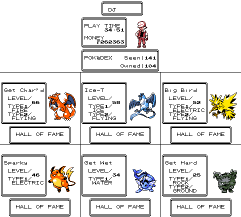
</p>

My crew after defeating the Elite Four and Gary.
I primarily got by with Master Balls, Max Elixier, and Full Restore.
I did use coins to get a few more Pokémon.
Wild table cheating was used only for the Safari Zone up to this point.
The aformentioned guides and [Pokered](https://github.com/pret/pokered) source were used while gringing in the wild to make sure I _got 'em all_.

I'd say that 34:51 time is probably closer to 20 hours.
I used FF (3x) for most wild grinding and battles.
I did however keep it at 1x in new cities, gyms, the Elite Four, etc... for the music, slow play, and the atmosphere.

<p align="center">
  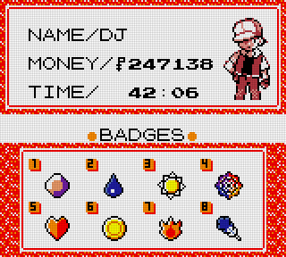
</p>

> What a punk.

The post-game trading, evolution, and wild table hacking to get all 151 added ~6 more game hours, but it was probably closer to two since most of it was with FF (3x) except meatspace trading.

My final [savefile](red-final.sav).

### Diploma

The Diploma, your reward for _catching 'em all._

<p align="center">
  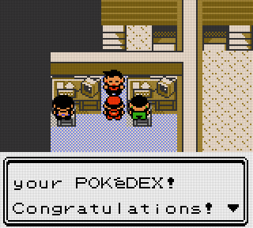
  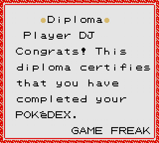
</p>

This is my only beef with the Red/Blue DX gen 2 color patch.
The Diploma does not look like others [online](https://bulbapedia.bulbagarden.net/wiki/Diploma).

This was the perfect opportunity to put my savefile on the original cart and verify:

<p align="center">
  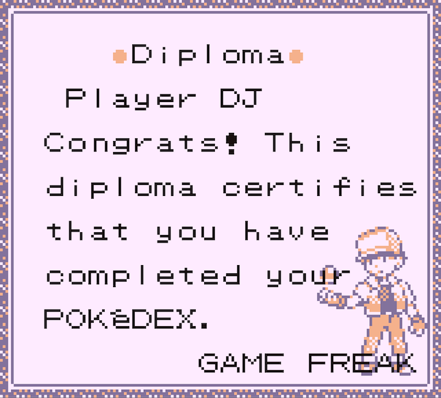
</p>

This image is from the original cart connected via [GB Operator](https://www.epilogue.co/product/gb-operator) and using their emulator which is based on [mGBA](https://mgba.io/).
And this _is_ a match with one of the images from https://bulbapedia.bulbagarden.net/wiki/Diploma.

What I get using the Analogue Pocket with the original ROM with a Game Boy Color core:

<p align="center">
  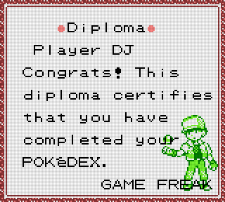
</p>

If I boot up the Blue ROM, I get:

<p align="center">
  
</p>

With the original Red cart, I get the following on the Pocket's DMG Core based on what palette I pick:

<p align="center">
  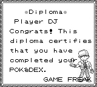
  
  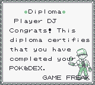
  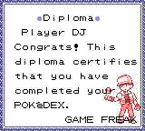
  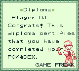
</p>

I guess until I land a real Game Boy Color, I'll never know what it should look like in meatspace.
It's not important, just a curiosity.

That all said, IMHO, the best looking Diplomas come from the Super Game Boy (also FPGA implemented on the Analog Pocket):

<p align="center">
  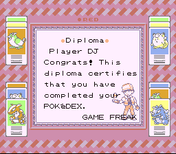
  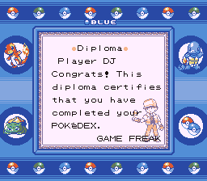
  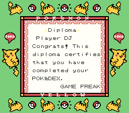
</p>


### _Was it worth it?_

Yes, absolutely.

It was a lot of fun writing the cheat code and learning about the Red internals, savefile format, [Pokémon game history](https://youtu.be/DaUHU2I-haA?si=zuBNovGTt7tgn0cx) and lore.
IMHO, every fan of video games, video game history, and/or Pokémon, should playthough Red and _catch 'em all!_

<p align="center">
  
</p>