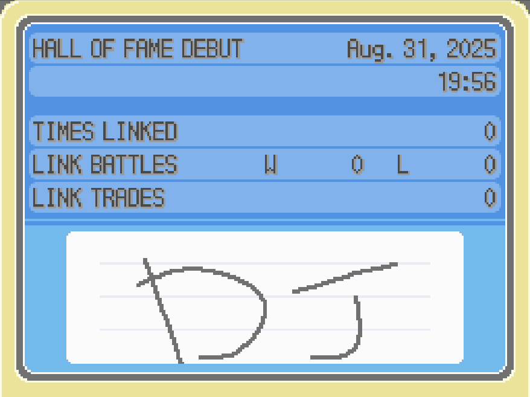
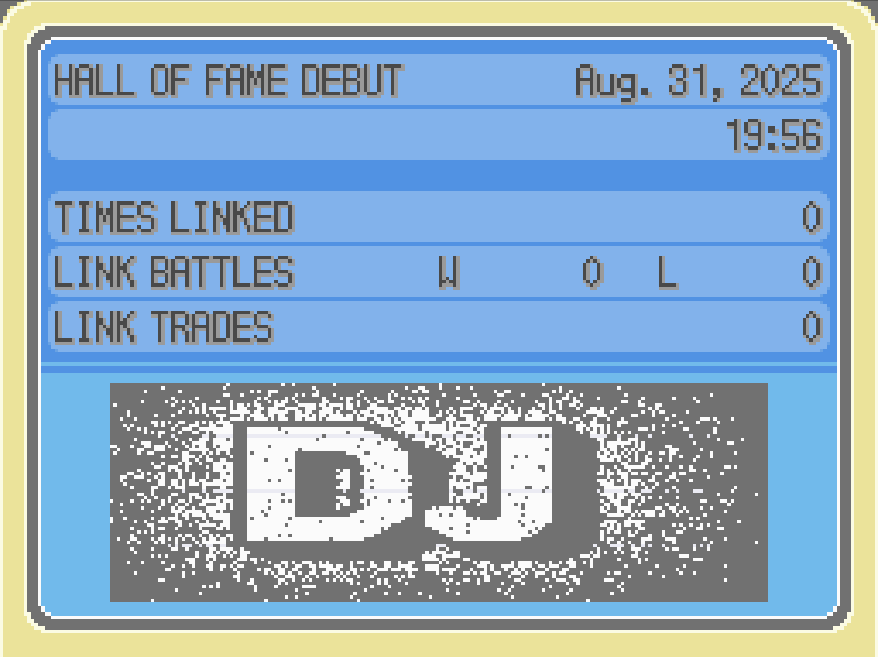
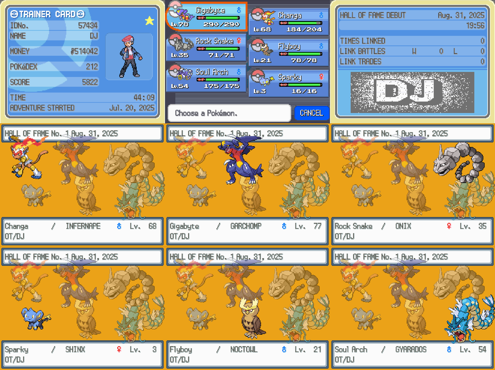
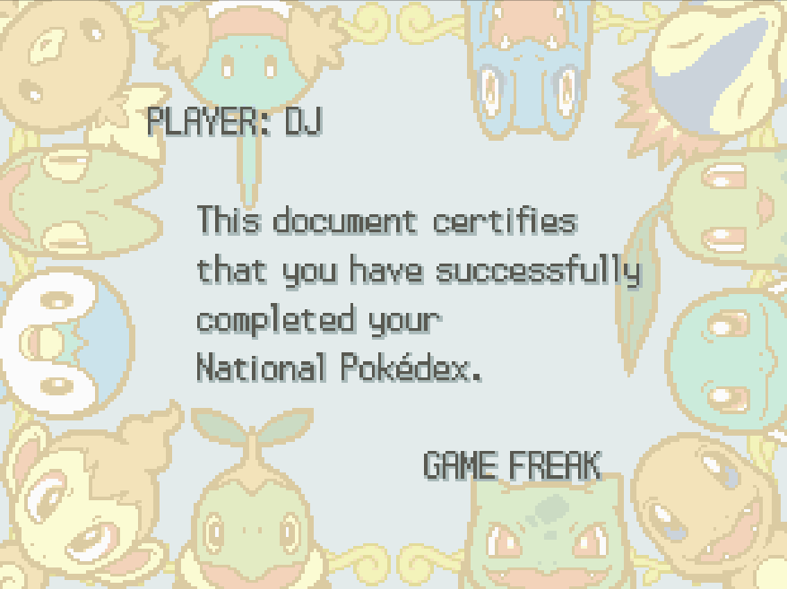
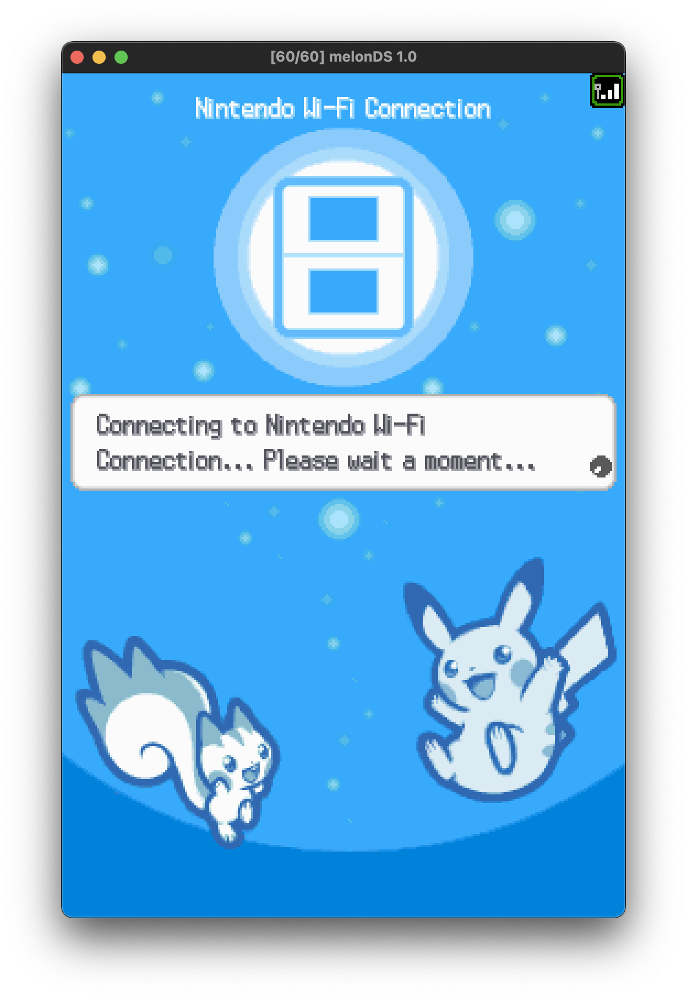
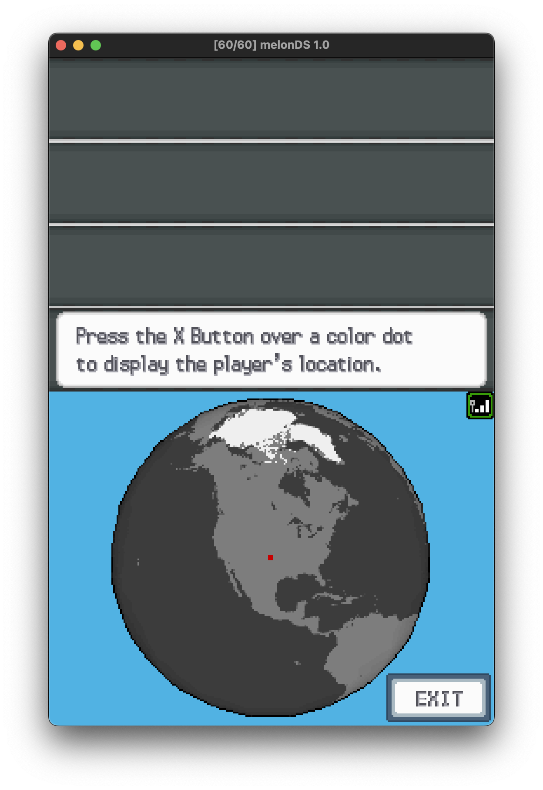
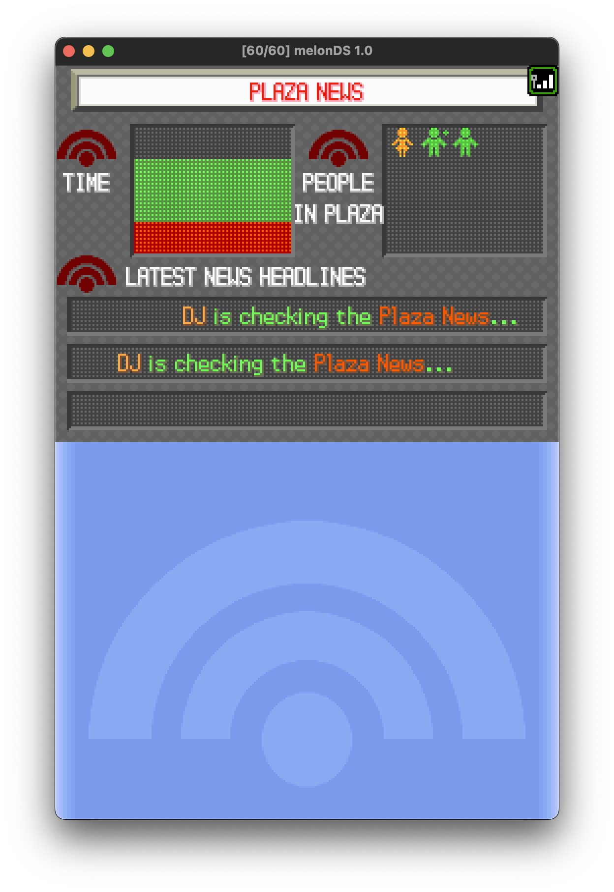
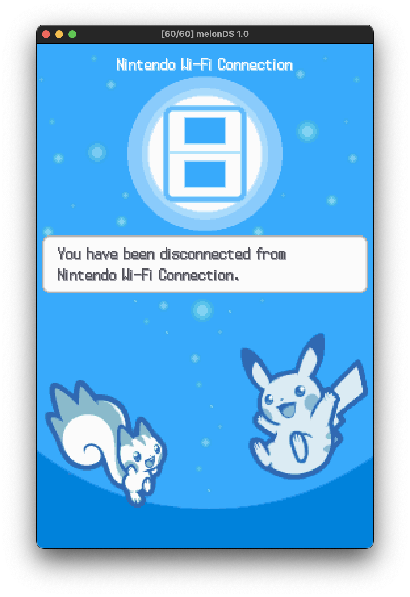

# Pokémon Platinum Postmortem (with cheat code)

*<p align="center"><br>[2024 is the first time I have played Game Boy or Pokémon games.<br>
FF and save file editing to reduce the toil is a must for me.<br>
I'm not a 10-year-old kid with unlimited time on my hands, and who am I going to trade with?<br>
-- datajerk<br><br>](https://www.reddit.com/r/AnaloguePocket/comments/1e9pc0g/comment/legxrj2/)</p>*


> If you're just looking for the cheat code, get all the `*.py` files in this repo,
it should be pretty easy to figure out.
Below was my thought process and evolution of the script with examples.
This isn't a comprehensive savefile editor, just what I needed for my playthrough.
Enjoy!


## Objective

I thought I was done with Pokémon last year (2024-2024),
but then the [Magicx Zero 40](https://shop.magicx.team/products/magicx-zero-40) released,
and I'd never had or played a DS game,
so I figured for this Summer's project I'd give a gen IV version a go.

This is my 5th Pokémon playthrough; my first was [Polished Crystal](https://github.com/Rangi42/polishedcrystal) (postmortem on hold) followed by [Red](../pokered/README.md), [Emerald](../pokeemerald/README.md), and [Unbound](https://www.mediafire.com/file/mi0wsf0ectslxr2/Pokemon+Unbound+(v2.1.1.1).zip/file).

Platinum is just as repetitive as [Red](../pokered/README.md) and [Emerald](../pokeemerald/README.md);
this is why I lost interest in playing other generations.
I was impressed with [Polished Crystal](https://github.com/Rangi42/polishedcrystal),
but then it was my first _mon_ game, and I played the main quest before writing my cheat code.
Since I had no prior experience I cannot say that it's vanilla Crystal or [Polished Crystal](https://github.com/Rangi42/polishedcrystal) that made it great,
or perhaps it was just my first.
I selected Crystal because I asked my kid,
_if I could only pick one to play, what should it be_;
without hesitation she said _Crystal_--she was right.

I played [Unbound](https://www.mediafire.com/file/mi0wsf0ectslxr2/Pokemon+Unbound+(v2.1.1.1).zip/file) after [Emerald](../pokeemerald/README.md) because I wanted to experience something different;
[Unbound](https://www.mediafire.com/file/mi0wsf0ectslxr2/Pokemon+Unbound+(v2.1.1.1).zip/file) does not disappoint.

My methods and rational are not dissimilar from my [Red](../pokered/README.md) and [Emerald](../pokeemerald/README.md) runs, and I'd recommend reading those postmortems first.

My objective was to experience [Pokémon Platinum](https://bulbapedia.bulbagarden.net/wiki/Walkthrough:Pok%C3%A9mon_Platinum) as quickly as possible
as game research vs. game play
without hours of repeated toil.

I should note that I did not have time to explore all of Platinum,
there are a lot of non-direct-quest elements like beauty contests,
building an underground lair, and 
making snacks for your _mon_ that I think increase some of your stats for getting non-direct-quest items.
The underground seems optimized for multiplayer use.
And, there are many network play options--this I fully intended to explore, and it is still possible, but I ran out of time for this project. (At the end for details.)

A retro YouTuber I follow stated that as a kid he got one game a year, so the aforementioned probably added a lot of value and fun for kids with lots of time on their hands.


## Tools and Resources

* [Magicx Zero 40](https://shop.magicx.team/products/magicx-zero-40), this setup checked the following boxes:
  * Real-Time-Clock (RTC)
  * Save states
  * Fast-forward (FF)
  * FTP server for backup/restore of save files (I used `lftp` to automate pulling down savefiles, save states, and screenshots)
  * Touch screen display for DS features (not required)
  * The DraStic DS emulator was the only real option; no WiFi or slow-mo
* [melonDS 1.0](https://melonds.kuribo64.net/) with [8BitDo SN30 Pro Bluetooth Gamepad](https://www.8bitdo.com/sn30-pro-g-classic-or-sn30-pro-sn/)
  * Slow-motion (slow-mo)--required for some bike moves
    * I think I ranted about this before; IMHO, RPGs should not require _meatspace_ dexterity
    * The screen and controller latency can make bike moves extra difficult (on any emulator, however RetroArch has run-ahead that I've not had time to explore)
  * WiFi support and it works! Get online with the handful of others also playing Platinum (see below for details)
* Guides
  * The Pokémon Platinum Prima Official Guide
  * [Bulbapedia Walkthrough: Pokémon Platinum](https://bulbapedia.bulbagarden.net/wiki/Walkthrough:Pok%C3%A9mon_Platinum)
* This decompilation of [Pokémon Platinum](https://github.com/pret/pokeplatinum) ("the source")
* Save data structure
  * [Save data structure (Generation IV)](https://bulbapedia.bulbagarden.net/wiki/Save_data_structure_(Generation_IV))
(incomplete so I used the source a bit (mostly for honey trees), however, as an initial overview it is indispensable)
  * [Platinum Save Structure](https://projectpokemon.org/home/docs/gen-4/platinum-save-structure-r81/), additional details missing from above
  * [PKHex Source](https://github.com/kwsch/PKHeX), used this to figure out the Pokédex
    * Probably wondering why I'd create my own cheat code and not just use PKHeX. Short answer, _it's fun_.


## Cheating

Main Storyline Guidelines:

1. No altering money (but coins OK, something I learned from my Polished Crystal post-game run).
1. No [offline] Rare Candy to level up.
1. Must "see" each Pokémon the way the game intended.

Post-Game Guidelines:

Post-Game postponed, probably indefinitely.


### Emulator Cheat Features

I use the following emulator cheats:

* FF 3x for grinding through trainer battles and fighting/capturing wild Pokémons
* Slowmo 10 FPS for bike tricks (fast cornering)
* Save states, while there as a backup, I did not use, other than QoL for suspend and resume


### Cheat Code

I wrote a small Python CLI tool called [gen4edit.py](gen4edit.py), and it should run on any Mac, Windows, or Linux platform with `python3 gen4edit.py [filename.sav]`.

> NOTE: You'll need all the `*.py` files in the same directory.
> 
> NOTE: Only Platinum is supported.

I'll cover the features mostly in the order I developed them and explain the need.

```
Main Menu

0.  Exit (and [over]write "newbag.sav")
1.  Items
2.  Medicine
3.  Poké Balls
4.  TM & HM
5.  Berries
6.  Mail
7.  Battle Items
8.  Key Items
9.  Sort Items
10. Sort Medicine
11. Sort Poké Balls
12. Sort Mail
13. Sort Battle Items
14. Sort Key Items
15. Sort All Items
16. Pokémon
17. Cold Storage [Boxes]
18. Pokédex: Sinnoh Id
19. Pokédex: Sinnoh Name
20. Pokédex: Sinnoh Id Unobtained
21. Pokédex: Sinnoh Name Unobtained
22. Pokédex: Sinnoh Id Unseen
23. Pokédex: Sinnoh Name Unseen
24. Pokédex: Sinnoh All Seen (WARNING: Cannot be unseen!)
25. Pokédex: National Id
26. Pokédex: National Name
27. Pokédex: National Id Unobtained
28. Pokédex: National Name Unobtained
29. Pokédex: National All Caught (WARNING: Cannot be undone!)
30. Trainer ID: 57434
31. Secret ID: 23429
32. Trainer Name: DJ
33. Gender: Boy
34. Money: 514042
35. Coins: 65535
36. Honey Trees
37. Lotto Number: 48099
38. Mystery Gift: locked
39. Clock Change Penality: 0
40. Rival Name: Barry
41. Save Signature to "sig.png"
42. Read Signature from "sig.png"
43. [Over]write "newbag.sav" and continue editing
44. Abort! (all changes since last write lost)
```

### Non-cheating QoL Features

Sorting items, listing the Pokédex, Listing Boxes (and organizing _mon_), and renaming _mon_ are the principal QoL features of this tool I used.  Other non-cheating QoL features: trainer and rival name changing, gender change, and signature read/write.

**Pokédex**

There are multiple Pokédex listings, but the format is the same, however the sorting and filtering will be different, e.g. `18. Pokédex: Sinnoh Id`:

```
Nat Sin Name              |  Nat Sin Name              |  Nat Sin Name              |  Nat Sin Name
--------------------------+----------------------------+----------------------------+--------------------------
387   1 Turtwig        ◎  |  416  54 Vespiquen    ◓ ◎  |  164 107 Noctowl      ◓ ◎  |  475 160 Gallade        ◎
388   2 Grotle         ◎  |  417  55 Pachirisu      ◎  |  442 108 Spiritomb      ◎  |  108 161 Lickitung    ◓ ◎
389   3 Torterra       ◎  |  418  56 Buizel       ◓ ◎  |  443 109 Gible        ◓ ◎  |  463 162 Lickilicky     ◎
390   4 Chimchar     ◓ ◎  |  419  57 Floatzel     ◓ ◎  |  444 110 Gabite       ◓ ◎  |  133 163 Eevee        ◓ ◎
391   5 Monferno     ◓ ◎  |  420  58 Cherubi      ◓ ◎  |  445 111 Garchomp     ◓ ◎  |  134 164 Vaporeon       ◎
392   6 Infernape    ◓ ◎  |  421  59 Cherrim        ◎  |  446 112 Munchlax     ◓ ◎  |  135 165 Jolteon        ◎
...
```

The first number is the National ID,
followed by the Sinnoh (regional) ID.
The `◎` indicates _seen_ and the `◓` indicates has _owned_ at sometime.


**Cold Storage [Boxes]**

```
Select box to edit:

0.  Return
1.  BOX 1
2.  BOX 2
3.  BOX 3
4.  BOX 4
5.  BOX 5
6.  BOX 6
7.  BOX 7
8.  BOX 8
9.  BOX 9
10. BOX 10
11. BOX 11
12. BOX 12
13. BOX 13
14. BOX 14
15. BOX 15
16. BOX 16
17. BOX 17
18. UNOWN
19. Swap Pokémon
```

From this menu you can open a box and edit the box name or any Pokémon, e.g.:

```
0.  Return
1.  Bat Shit     Zubat        OT ID: 57434  Exp:      64  Friendship:  70
2.  MAGIKARP     Magikarp     OT ID: 57434  Exp:     156  Friendship:  70
3.  Dude         Geodude      OT ID: 57434  Exp:     135  Friendship:  70
4.  Suck It!     Psyduck      OT ID: 57434  Exp:     729  Friendship:  70
5.  Oof          Bidoof       OT ID: 57434  Exp:      27  Friendship:  86
6.  SHELLOS      Shellos      OT ID: 57434  Exp:    1331  Friendship:  70
7.  BUDEW        Budew        OT ID: 57434  Exp:     135  Friendship:  70
8.  Manny        Machop       OT ID: 57434  Exp:     236  Friendship:  70
9.  Charap       Chatot       OT ID: 44142  Exp:     560  Friendship:  41
10. Shock'em     Rotom        OT ID: 57434  Exp:    8000  Friendship:  70
11. GASTLY       Gastly       OT ID: 57434  Exp:    1261  Friendship:  70
12. CASCOON      Cascoon      OT ID: 57434  Exp:    1728  Friendship:  70
13. Cadabra      Abra         OT ID: 57434  Exp:      96  Friendship: 118
14. SILCOON      Silcoon      OT ID: 57434  Exp:    1728  Friendship:  70
15. Knik Knak    Kricketot    OT ID: 57434  Exp:      57  Friendship: 127
16. Star         Starly       OT ID: 57434  Exp:      57  Friendship: 124
17. DUSTOX       Dustox       OT ID: 57434  Exp:    2744  Friendship:  70
18. PONYTA       Ponyta       OT ID: 57434  Exp:    4096  Friendship:  70
19. GLIGAR       Gligar       OT ID: 57434  Exp:    3798  Friendship:  70
20. BRONZOR      Bronzor      OT ID: 57434  Exp:    8000  Friendship:  70
21. STARAVIA     Staravia     OT ID: 57434  Exp:    4575  Friendship:  70
22. MEDITITE     Meditite     OT ID: 57434  Exp:    8000  Friendship:  70
23. CHINGLING    Chingling    OT ID: 57434  Exp:    5487  Friendship:  70
24. NOSEPASS     Nosepass     OT ID: 57434  Exp:    5832  Friendship:  70
25. CLEFAIRY     Clefairy     OT ID: 57434  Exp:    3930  Friendship: 140
26. ROSELIA      Roselia      OT ID: 57434  Exp:    4575  Friendship:  70
27. RALTS        Ralts        OT ID: 57434  Exp:    7290  Friendship:  35
28. CHANSEY      Chansey      OT ID: 57434  Exp:    3930  Friendship: 140
29. Egbert       Togepi       OT ID: 57434  Exp:       0  Friendship: 144
30. BUNEARY      Buneary      OT ID: 57434  Exp:    1331  Friendship:  45
```

Also from the main box menu you can move _mon_ around:

```
Selection: 19

Swap Pokémon

 1. BOX 1                       2. BOX 2

 1. Bat Shit     Zubat          1. HOOTHOOT     Hoothoot
 2. MAGIKARP     Magikarp       2. MUNCHLAX     Munchlax
 3. Dude         Geodude        3. GOLDEEN      Goldeen
 4. Suck It!     Psyduck        4. BLANK
 5. Oof          Bidoof         5. WURMPLE      Wurmple
 6. SHELLOS      Shellos        6. BURMY        Burmy
 7. BUDEW        Budew          7. CHERUBI      Cherubi
 8. Manny        Machop         8. AIPOM        Aipom
 9. Charap       Chatot         9. HERACROSS    Heracross
10. Shock'em     Rotom         10. MUNCHLAX     Munchlax
11. GASTLY       Gastly        11. DUSKULL      Duskull
12. CASCOON      Cascoon       12. UNOWN        Unown
13. Cadabra      Abra          13. E.V.         Eevee
14. SILCOON      Silcoon       14. SCYTHER      Scyther
15. Knik Knak    Kricketot     15. ?            Unown
16. Star         Starly        16. MARILL       Marill
17. DUSTOX       Dustox        17. LICKITUNG    Lickitung
18. PONYTA       Ponyta        18. KADABRA      Kadabra
19. GLIGAR       Gligar        19. ROSELIA      Roselia
20. BRONZOR      Bronzor       20. Polygon      Porygon
21. STARAVIA     Staravia      21. !            Unown
22. MEDITITE     Meditite      22. HIPPOPOTAS   Hippopotas
23. CHINGLING    Chingling     23. HOUNDOUR     Houndour
24. NOSEPASS     Nosepass      24. GRAVELER     Graveler
25. CLEFAIRY     Clefairy      25. RHYHORN      Rhyhorn
26. ROSELIA      Roselia       26. GIRAFARIG    Girafarig
27. RALTS        Ralts         27. REMORAID     Remoraid
28. CHANSEY      Chansey       28. WINGULL      Wingull
29. Egbert       Togepi        29. SHELLOS      Shellos
30. BUNEARY      Buneary       30. QUAGSIRE     Quagsire

Commands:

b[1-18],[1-18] to choose boxes
b[1-18],       to choose first box only
b,[1-18]       to choose second box only
p[1-30],[1-30] to swap box1,p1 with box2,p2
x or 0         to exit
```

Basically select your boxes (you can use the same box in both columns), then select which _mon_ to swap (you can swap with `BLANK`).

> I wrote this because it interested me; I had no utility for this.


**Pokémon**

The Pokémon menu is both for QoL and cheating, but I used mostly for QoL and experimenting with different settings to better understand the outcome in the game:

```
Pokémon Menu

0. Return
1. Gigabyte     Garchomp     OT ID: 57434  Exp:  594839  Friendship: 255
2. Changa       Infernape    OT ID: 57434  Exp:  318925  Friendship: 255
3. Rock Snake   Onix         OT ID: 57434  Exp:   43476  Friendship: 255
4. Flyboy       Noctowl      OT ID: 57434  Exp:    9261  Friendship: 255
5. Soul Arch    Gyarados     OT ID: 57434  Exp:  207820  Friendship: 255
6. Sparky       Shinx        OT ID: 57434  Exp:      57  Friendship: 255
```

From here you can edit any of the _mon_ in your party; the same edit code is used when selecting a _mon_ from a box as well:

```
Edit Pokémon

0.  Return
1.  Name: Sparky
2.  Experience: 57
3.  Friendship: 255
4.  Ability: 22
5.  Markings: 0
6.  Sheen: 255
7.  Cool: 0
8.  Beauty: 0
9.  Cute: 0
10. Smart: 0
11. Tough: 0
```

Fixing names due to typo is the most common use, however I did experiment with changing other settings:

* Experience, if you change this (assuming you'd only increase), then on next battle you'll level up, sometimes a lot depending on how high you set this.  I did not test changing this setting for box _mon_.
* Friendship, unsure what this does, IIRC, in past games with a low friendship you ran the risk of the _mon_ just refusing to battle. There was an NPC that refused to give me something (I cannot remember what), so I assumed it was the friendship level to maxed out, but later I discovered it was the sheen.

The other settings probably help with contests and other non-direct-quest elements that I had no interested in exploring (no time).


**Signature Read/Write**

The last non-cheating QoL of interest is the ability to save your trainer card signature as a `.png` as well as replace with an existing `.png`, e.g.:

On the left was the best I could do with my finger on the tiny screen of the [Magicx Zero 40](https://shop.magicx.team/products/magicx-zero-40); the right was generated by ChatGPT, then my code converted to B&W and stretched to fit:

<p align="middle">
  
  
</p>


### Cheat: Adding Items

**Master Balls, Max Elixir, Full Restore, Max Revive, PP Max**

Just like [Red](../pokered/README.md) and [Emerald](../pokeemerald/README.md) I played as intended until out of the tutorial phase, then I upped my Master Balls, Max Elixir, Full Restore, Max Revive, and PP Max; and for the same reasons:

* Master Balls,
because I do not see the need for excessive toil capturing wilds with the right mix of balls,
Pokémon, moves, items, and levels to beat them down.
IMHO, it does not change the story or broader experience of the game.
* Max Elixir, Full Restore, Max Revive, to save trips to the Pokémon Center--just top off in field.  Again, trying to save time and reduce toil.
* PP Max, to reduce having to use Max Elixir.

As stated in my [Red Postmortem](../pokered/README.md), I've had my honor-mode run with Polished Crystal.


### Cheat: Money and Coins

Coins are only used in the casino, and I'm sure it's for _[entertainment purposes only](https://en.wikipedia.org/wiki/Gambling_in_Japan#Pachinko)_.

These casinos are a real pain, so I just maxed out the coins to buy all the TMs that I never used.

> In game the max is 50,000, however you can set to 65,535 without issue.

The money hack was never used, it's there for others.


### Cheat: Lotto Number

This hack is not necessary, but I didn't know that when I coded it up, I was also curious about the outcome.

To use just set to any Pokémon OT ID (most likely one will be your Trainer ID on the main menu) just before playing the _Loto_ (their misspelling not mine), and boom!  You win a Master Ball.


### Cheat: Honey Trees

This will setup all trees with the tree _mon_ of your choice for 18 hours:

```
Select encounter for all Honey Trees (you will have 18 game hours to encounter):

0. Return
1. Combee
2. Wurmple
3. Burmy
4. Cherubi
5. Aipom
6. Heracross
7. Munchlax

Selection: 7

All Honey Trees loaded with Munchlax; you have 18 game hours to encounter.
```


## Main Storyline Epilogue

<p align="center">
  
</p>

My final crew post champion status.
Gigabyte and Changa did most of the battles, while the rest provided HM support (Rock Snake and Soul Arch did get some combat in from time to time); Sparky was just along for the ride.

Changa was my main until I picked up Gigabyte.
Exp. Share was used to level up Changa, Rock Snake, and Soul Arch.
While testing _mon_ experience editing I bumped both Gigabyte and Change from the 100,000s up to 200,000 to see what would happen and just left it there. This gave me ~10-20 level advantage throughout the game and rarely did I need any other than Gigabyte with the exception of the existing champ Cynthia--I had to work a bit for that win.

Game time was reported as ~44 hours; I have no idea if that is wall-clock time or playtime, in past games the playtime was computed without using the RTC wall clock time.


### _Gotta see them all!_

Platinum unlike the others I've played will grant you your regional diploma for just _seeing_ them all.
I was careful to exchange blows with every trainer, however I missed one on route 210 that I could not get to at the time (needed a bike), so backtracking to that to get the remaining two was essential.

Out of curiosity I added a hack to toggle the dex bits so I could see the National diploma, make no mistake, I didn't pursue this at all, I read up on it and it looks like 100s of hours of toil.

<p align="middle">
  
  
</p>


## Post-Game Epilogue

Not going to happen, just no time; I did this with [Emerald](../pokeemerald/README.md) and I'm not sure there is much point or difference in the experience.

That said, I did try out the WiFi a bit and if I had the time I would have tried online trades and battles, et al; there are still people out there playing this and there are servers to support them.


### Getting online

You'll want to use [melonDS 1.0](https://melonds.kuribo64.net/) for the easy path, however you can use OG hardware as well, but you're on your own for that.

For [melonDS 1.0](https://melonds.kuribo64.net/) follow this guide: https://melonds.kuribo64.net/board/thread.php?id=285, and use Kaeru: 178.62.43.212.

Some screen shots:

<p align="middle">
  
  
</p>

<p align="middle">
  
  
</p>

I tested this as soon as I got my first badge, and as you can see there were others there (PLAZA NEWS) as well.

I intended to go back and test other things and better document, but again, no time.
I did chat with someone; chat is limited to canned phrases, so not really too exciting, but safe for kids.


### Final Thoughts

Easier than [Emerald](../pokeemerald/README.md) and probably all other gen I-III versions.
The honey tree toil is terrible, if I ever did replay this in honor mode, I'd still cheat on that, same with the slow-mo hacks for the bike.
The non-direct-quest gimmicks are not for me, however the WiFi social aspect certainly is.

I still think [Polished Crystal](https://github.com/Rangi42/polishedcrystal) and [Pokémon Unbound](https://www.pokecommunity.com/threads/pok%C3%A9mon-unbound-completed.382178/) are peak Pokémon.  Both [Polished Crystal](https://github.com/Rangi42/polishedcrystal) and [Unbound](https://www.pokecommunity.com/threads/pok%C3%A9mon-unbound-completed.382178/) correct numerous issues that enhance game play and reduces toil.
